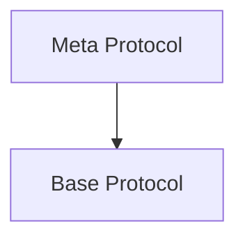

# DWN Bi-Weekly Calls Notes

## Summary

Bi-weekly DIF call notes on DWN specifications.

- [Github](https://github.com/decentralized-identity/decentralized-web-node)
- [Wiki](https://identity.foundation/decentralized-web-node/spec/)

**Editors**

- Dan Buchner @csuwildcat
- Tobias Looker (Mattr)

**Contributors**

- Henry Tsai (Microsoft)
- XinAn Xu (Microsoft)
- Moe Jangda (Block)

**Co-Chairs**

- Andor Kesselman @andorsk email: andor@benri.io
- Liran Cohen @lirancohen

## DIF Meeting April 19, 2023

### Attendees

- Andor Kesselman @andorsk
- Liran Cohen @liran
- Dan Buchner @csuwildcat

### Agenda

Hopefully we can get spec alignment today.

| Item            | Segment                 | Time   | Owner           | Description                                                                     |
| --------------- | ----------------------- | ------ | --------------- | ------------------------------------------------------------------------------- |
| Intro           | Intro                   | 5 min  | @liran          | Quick Intro. New Members. DIF IPR agreement.                                    |
| Agenda          | Companion Guide Updates | 10 min | @andorsk/Moises | Merge https://github.com/decentralized-identity/decentralized-web-node/pull/226 |
| [TBD Updates]() | Updates                 | 10 min | @csuwildcat     |                                                                                 |
| Spec Alignment  | Spec Alignment          | 10 min | @andorsk        | Alignment                                                                       |
| Issue Alignment | Issue Alignment         | 10 min | @liran          | Alignment                                                                       |
| Calls To Action | Closing                 | 5 min  | @andorsk        |                                                                                 |

### Notes

- Discussed: How we get TBD's updates into issues.
- We called this meeting short as there were not enough participants.

## DIF Meeting March 22, 2023

Again this week we are overbooked with content. That's because we have a lot of cleanup to do!

### Attendees

- Andor Kesselman @andorsk
- Liran Cohen  
- Dan Buchner @csuwildcat

### Agenda

| Item  | Segment | Time  | Owner    | Description                                  |
| ----- | ------- | ----- | -------- | -------------------------------------------- |
| Intro | Intro   | 5 min | @andorsk | Quick Intro. New Members. DIF IPR agreement. |
| Spec Updates | Updates | 5 min | @liran |[Interface & Method Props](https://github.com/decentralized-identity/decentralized-web-node/commit/e964c28a3712b3873e041e614c2c5fb9c5878855) | 
| Companion Guide Updates | Updates | 5 min | @andorsk | - Tall Ted Comments on [#216](https://github.com/decentralized-identity/decentralized-web-node/pull/216) |
| [TBD Updates]()                                                                                        | Updates     | 10 min  | @csuwildcat      |  - Close on the web5 sdk front. Will make working with the DWN much easier.   - Dan working on encryption prototype ETA couple weeks.   - Moe : Sync next week start.   - https://github.com/TBD54566975/web5-js   NOTE: alpha   https://codesandbox.io/p/sandbox/trusting-mountain-u91fjr?file=%2Fsrc%2Findex.mjs&selection=%5B%7B%22endColumn%22%3A40%2C%22endLineNumber%22%3A121%2C%22startColumn%22%3A40%2C%22startLineNumber%22%3A121%7D%5D                                                             |
| PR Review | Maintenence | 5 min | @andorsk | - [#217](https://github.com/decentralized-identity/decentralized-web-node/pull/217) - [#216](https://github.com/decentralized-identity/decentralized-web-node/pull/216)  - [#215](https://github.com/decentralized-identity/decentralized-web-node/pull/215) |
| Milestones and Dates | Discussions | 10 min | @andorsk | [#214](https://github.com/decentralized-identity/decentralized-web-node/issues/214)|
| TBD Alignment Updates | Discussions | 10 min | @csuwildcat | |
| Add Technology Comparison Matrix to Companion Guide #212 | Discussions | 10 min | @moisesja | [#212](https://github.com/decentralized-identity/decentralized-web-node/issues/212)
| Companion Guide Security Section | Discussions | 10 min | @andorsk | [#218](https://github.com/decentralized-identity/decentralized-web-node/issues/218)
| Label Review and Tagging | Maintenence | 20 min | @liran |Go through each open issue and figure out strategy to close them|
| Calls To Action                                                                                        | Closing     | 5 min   | @andorsk         |                                                                                                                                                                                                                        |

### Notes

- PR Review: Suggestion by @lirancohen: Bring up in meetings and give time until next meeting to approve/merge.
- [Potential Encryption Scheme from Block](https://codesandbox.io/p/sandbox/trusting-mountain-u91fjr?file=%2Fsrc%2Findex.mjs&selection=%5B%7B%22endColumn%22%3A15%2C%22endLineNumber%22%3A121%2C%22startColumn%22%3A15%2C%22startLineNumber%22%3A121%7D%5D)
- Mid-April Jukebox App - Play music from DWN Nodes.Trying to bend the model of how it differs from NOSTR. 
- Dan: April 5 : Austin Texas TBD building docs. Open to meeting and getting some contributions.
- [Milestone 1: August](https://github.com/decentralized-identity/decentralized-web-node/milestone/1) 

Suggestion For Next Meeting:

- Get consensus for get together next meeting @ Austin. 

#### Action Items
- [ ] Find a cryptographer to look at the encryption scheme for DWN. @lirancohen will ask around. @andorsk as well. 
- [ ] Call next week : Spec walkthrough. Henry to run through the spec and update it to the current state of the sdk. 

## DIF Meeting March 8, 2023

### Attendees

- Andor Kesselman @andorsk
- Dan Buchner @csuwildcat
- Kaliya 
- Clare Nelson (DIF)
- Liran Cohen
- Moises Jaramillo
- Paul Trevithick 
- Reuben
- Steve
- Sergey Kucherenko
- Kirill Khalitov

### Agenda

Note: We are over-booked today in terms of content! Currently at 105 minutes, we
will have to figure out ways to shave or push off some of these conversations.

| Item                                                                                                   | Segment     | Time    | Owner            | Description                                                                                                                                                                                                            |
| ------------------------------------------------------------------------------------------------------ | ----------- | ------- | ---------------- | ---------------------------------------------------------------------------------------------------------------------------------------------------------------------------------------------------------------------- |
| Co-Chair Updates. Nominate Liran as Co-Chair.                                                           | Intro       | 5 min   | @andorsk @liran  |                                                                                                                                                                          Kaliya to follow up                                              |
| Spec Updates                                                                                           | Updates     | 5 min   |      @andorsk        | No updates to the specs                                                                                                                                                                                                |
| Companion Guide Updates                                                                                | Updates     | 10 min  | @andorsk @moises | - [Questions on AMA](https://github.com/decentralized-identity/decentralized-web-node/pull/216)   - [Comparision Matrix (Moises)](https://github.com/decentralized-identity/decentralized-web-node/issues/212)   : List of comparables, SOLID PODS, KERI, |
| [TBD Updates]()                                                                                        | Updates     | 10 min  | @csuwildcat      | - MessageStore Refactoring - Add participants actor to Protocol rules #242                                                                                                                                       |
| [Issue 210](https://github.com/decentralized-identity/decentralized-web-node/issues/210)               | Maintenance | 5 min   | @csuwildcat      |                                                                                                                                                                                                                        |
| [Issue 208](https://github.com/decentralized-identity/decentralized-web-node/issues/208)               | Maintenance | 5 min   | @csuwildcat      |                                                                                                                                                                                                                        |
| [Issue 207](https://github.com/decentralized-identity/decentralized-web-node/issues/207)               | Maintenance | 5 min   | @andorsk         |                                                                                                                                                                                                                        |
| Tagging and Milestones                                                                                 | Discussion  | 10 min  | @andorsk         |                                                                                                                                                                                                                        |
| Specification Updates Discussion                                                                       | Discussion  | 5 min   | @andorsk         | Alignment on DWN-SDK vs. spec. TODO: Code spec review. @andor to set an issue.                                                                                                                                                                                          |
| [Milestones and Dates](https://github.com/decentralized-identity/decentralized-web-node/issues/214)    | Discussion  | 20 min. | @andorsk         | Better clarity on milestones and dates                                                                                                                                                                                 |
| [Schema PR](https://github.com/decentralized-identity/decentralized-web-node/pull/209)                 | Discussion  | 10 min. | @andorsk         | Schemas for objects in DWN                                                                                                                                                                                             |
| [Test Suite Conversation](https://github.com/decentralized-identity/decentralized-web-node/issues/213) | Discussion  | 10 min. | @andorsk         | Questions around test suite                                                                                                                                                                                            |
| Encryption Brainstorming                                                                               | Discussion  | 10 min  | @csuwildcat      |                                                                                                                                                                                                                        |
| Calls To Action                                                                                        | Closing     | 5 min   | @andorsk         |                                                                                                                                                                                                                        |

### Notes

* Expanded Query Support: 
* Making the use of DWNs easier. 
* https://github.com/TBD54566975/web5-js
* Rollup of everything. DID Support. Not instantiation. 
* Easier to interface 
* Q: SDK up to date with the spec? A: Yes, but sync spec text to add
@Clare: to look onto documentation on how to milestone this. 
* Encryption Discussion:
    * Dan: Cryptree
* Drummond: ToIP TSP interested in how all these components interlock. Question about EDV encryption. 
* Q: There is a diagram at the very top of the standard draft and it mentions that each DWN is also a relay server. Do you consider any modifications where the relay server is not self-hosted but is an external service? @andorsk  to add onto the companion guide with an answer. 
Paul: To help expand on the use case section.
- Andor Q: Protocol repository at DIF? Liran: not sure. Drummond: nomenclature issue. Protocol as a term is hard term in the larger ecosystem. Must distinguish between Protocol. Paul: Agrees. Discusses **meta-protocol**. Dan: agrees with putting in the repo. Clare: **IPR to consider**

## DIF Meeting February 22, 2023

### Attendees

- Andor Kesselman @andorsk
- Dan Buchner @csuwildcat
- kaliya
- Liran Cohen
- Ajay Jadhav
- Drummond Reed @talltree
- Sergey Kucherenko
- Clare Nelson
- Paul Trevithick

### Agenda

| Item                                 | Time   | Owner                | Description                                                                                                                                                                                                                                                                                                                                                                                                                                                    |
| ------------------------------------ | ------ | -------------------- | -------------------------------------------------------------------------------------------------------------------------------------------------------------------------------------------------------------------------------------------------------------------------------------------------------------------------------------------------------------------------------------------------------------------------------------------------------------- |
| **Co-Chair Intro and Co-Chair Call** | 5 min  | @andorsk             | Intro, meeting notes, and discuss [efforts to find a co-chair](https://hackmd.io/@andorsk/H16_4_w6j/edit)                                                                                                                                                                                                                                                                                                                                                      |
| **Office Hours Announcement**        | 5 min  | @csuwildcat          | Mention DWN office hours happening on the TBD discord channel                                                                                                                                                                                                                                                                                                                                                                                                  |
| **New Issues/PRs**                   | 15 min | @andorsk @csuwildcat | Discuss the following issues:  [#208](https://github.com/decentralized-identity/decentralized-web-node/issues) [#207](https://github.com/decentralized-identity/decentralized-web-node/issues/207)                                                                                                                                                                                                                                                       |
| **TBD Updates**                      | 15 min | @csuwildcat          | Any updates from Dan/TBD related to new work/open repos.  **SDK Updates**  - DWN Aggregator   Bump to [0.0.22](https://github.com/TBD54566975/dwn-sdk-js/commit/576fda4858423b6ea80209997865d7470c811525)   - [#231 introduced DataStore as a peer interface to MessageStore #233](<[asdf](https://github.com/TBD54566975/dwn-sdk-js/commit/576fda4858423b6ea80209997865d7470c811525)>) **Tool Updates**  - DWN Aggregator   - Music App? |
| **Open PR: Discussion #206**         | 15 min | @andorsk             | [#206](https://github.com/decentralized-identity/decentralized-web-node/pull/206). Discuss overview and Q&A section.                                                                                                                                                                                                                                                                                                                                           |
| **Calls to Action**                  | 5 min  | @andorsk             | Note calls to action                                                                                                                                                                                                                                                                                                                                                                                                                                           |

### Notes

Question from Paul: why store in electron? Dan: can store keys 1:1 way

### Calls to Action

- [ ] Co-chair @kaliya posted a list
- [ ] Note your questions in Github! Highly upvoted questions will make their way over to companion guide.
- [ ] Alex offerred to spin up a possible video to help people get started.
- [ ] Suggestion: Guest blog on DIF. Introduction and call to action.
- [ ] @andorsk to merge PR 206 in.
