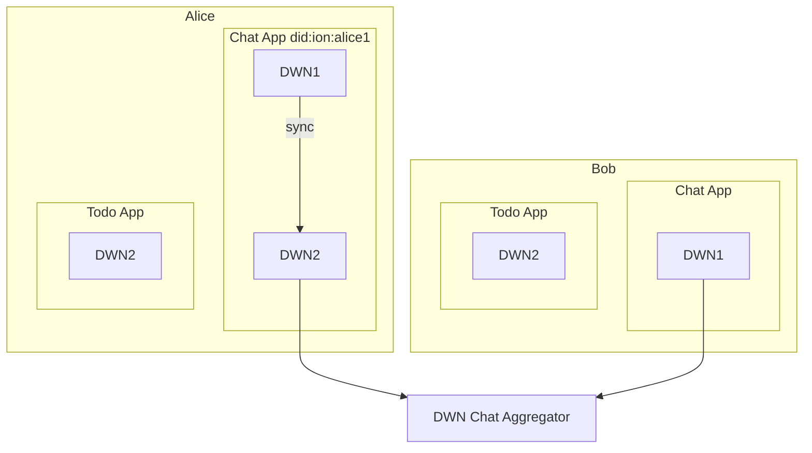

# Decentralized Web Node Companion Guide (DWN)

**STATUS:** PRE-DRAFT

The companion guide is intended to be a supportive guide to the core [spec guide](https://identity.foundation/decentralized-web-node/spec/). It is intended to make DWN's more accessible for the general audience.

- 3 efforts need to happen:
  - Improving the specifications on DWNs
  - Providing better tools for adoption both code and documentation
  - Better understanding of how the larger ecosystem interacts with DWNs.

## Overview

- Describe the intent of DWNs
  - Implicit: Why are other methods not sufficient.
- Why it's valuable and who benefits from DWNs.
- Overview of DWNs.
  - What they do
  - How they work
  - Basic architecture
- Design principles of DWNs
  - What's the Lift?

## Target audience of this document

- Proposal: Developers implementing DWNs, Architects, and Solution providers trying to understand the value proposition of DWNs.

## Terminology

This is explaining terminology on a funcational level, not a specification level.

- **IPFS** :: A protocol, hypermedia and file sharing peer-to-peer network for storing and sharing data in a distributed file system.
- **DWN** :: A data storage and message relay mechanism entities can use to locate public or private permissioned data related to a given Decentralized Identifier (DID).
- **DID** :: Decentralized identifiers (DIDs) are a type of globally unique identifier that enables an entity to be identified in a manner that is verifiable, persistent (as long as the DID controller desires), and does not require the use of a centralized registry.
- **[DAG CBOR](https://github.com/ipld/specs/blob/master/block-layer/codecs/dag-cbor.md)** :: DAG-CBOR is a codec that implements the IPLD Data Model as a subset of CBOR, plus some additional constraints for hash consistent representations.
- **Requests Objects** :: Request Objects are JSON object envelopes used to pass messages to Decentralized Web Nodes.
- **Collection** :: An interface of Decentralized Web Nodes provides a mechanism to store data relative to shared schemas.
- **Protocol** :: Protocols introduces a mechanism for declaratively encoding an app or service’s underlying protocol rules, including segmentation of records, relationships between records, data-level requirements, and constraints on how participants interact with a protocol
- **Hook** :: Web Hooks are one-way pushes of data to subscribed entities.
- **[IANA Media Type](https://www.iana.org/assignments/media-types/media-types.xhtml)** :: A two-part identifier for file formats and format contents transmitted on the Internet aka MIME type.
- **JSON Web Signature ( JWS )** :: Content secured with digital signatures or Message Authentication Codes (MACs) using JSON-based data structures
- **Content Identifier (CID)** :: A label used to point to material in IPFS
- **Message** :: All Decentralized Web Node messaging is transacted via Messages JSON objects. These objects contain message execution parameters, authorization material, authorization signatures, and signing/encryption information

## Technology Comparison

Note from @andorsk : I had a conversation with Simon about this, and @simon will be adding his comparisions to this.
TODO: what technology should beon t

### DWN vs DIDComm vs. KERI

Note from @andorsk. This is really early. I need to go through this more carefully tbh, and there are details I need to review.

| Capability                          | DWN           | KERI | DIDComm |
| ----------------------------------- | ------------- | ---- | ------- |
| Web Hooks                           | Yes           | No   | No      |
| Permissions                         | Yes           | ?    | ?       |
| Standard Storage Layer              | Yes           | ?    | ?       |
| JSON Schema Based                   | Yes.          | ?    | ?       |
| Custom Protocols                    | Yes           | No   | Yes     |
| Multi-Node Sync                     | Yes.          | ?    | ?       |
| DID Based                           | Yes.          | .    | Yes     |
| Out of Band Support                 | No            | Yes  | Yes     |
| Multiple CryptoSuites               | No            |      | Yes     |
| Off Ledger                          | No.           | Yes  | Yes     |
| 3+ Node Interactions                | Yes.          | ?    | ?       |
| Distributed sync                    | ? ( Future? ) | ?    | ?       |
| Completely Anonymous Transactions   |               |      |         |
| p2p ( no intermediary ) trasactions | No.           | Yes  | Yes     |

## Using a DWN

### Architecture

TODO: Commentary on architecture

### Data Flow

TODO: Commentary on data flow

### Building your own applications

## Examples

In this section, focus will be to show how this would work, and elaborate on the advantages a DWN based solution would have over a DIDComm based solution.

#### Chat App

#### Todo App

#### Buying a Plane Ticket

#### Coordinating Travel Plans

#### Applying for a job

#### Multi-exchange example

#### Hook example

#### Share music playlist

#### Medical Health Record: Query attributes of the data

## DWNS at Scale

### Multiple DWN Architecture

#### Scenario:

- Alice and Bob
- Alice has a Chat App. 1 Replica. Full sync.
- Bob's does not have a replica. Single node deployment.
- Todo App's are self contained.
- Chat aggregator is a message board, shows messages from many chats.

#### Topology

## Reference Implementations

- [TBD's JS SDK](https://github.com/TBD54566975/dwn-sdk-js) : Javascript sdk
- [TBD's Web 5 Implementation](https://github.com/TBD54566975/incubating-web5-labs)

## Use Cases

## Limitations

- Out of band
  - Possible: Not addressed yet but on roadmap
-

## Other Considerations

- Working with Non-DWN based wallets

## Action Item:

- [ ] Figure out where this document goes.

# DWN Companion Guide

## Use Cases

**Status** IN PROGRESS

Example Use case table
| Use Case | Reference |
| -------- | -------- |
| Exchange credentials | [link](#exchange-credentials)
| Share Music Playlist | [link](#music-playlist)
| Apply for a job | [link](#apply-for-job)
| Rent a car | [link](#rent-a-car)
| Chat Service | [link](#chat-service)
| Buy a plane ticket | [link](#plane-ticket)
| Buy a concert ticket | [link](#concert-ticket)
| Payroll analysis | [link](#payroll)

### Actors

- Bob: typically the issuer
- Alice: typically the holder
- Oscar: typically the role of the adversary
- Carol: typically the service provider
- Ted: typically the middle man

### Exchange Credentials

**Description:**
**Stake Holders:**
**How it works:**
**Advantages of using DWNs:**

### Share Music Playlist

**Description:**
**Stake Holders:**
**How it works:**
**Advantages of using DWNs:**

### Apply for a Job

**Description:**
**Stake Holders:**
**How it works:**
**Advantages of using DWNs:**

### Rent a car

**Description:**
**Stake Holders:**
**How it works:**
**Advantages of using DWNs:**

### Chat Service

**Description:**
**Stake Holders:**
**How it works:**
**Advantages of using DWNs:**

### Buy a plane ticket

**Description:**
**Stake Holders:**
**How it works:**
**Advantages of using DWNs:**

### Buy a concert ticket

**Description:**
**Stake Holders:**
**How it works:**
**Advantages of using DWNs:**

### Manage Payroll

**Description:**
**Stake Holders:**
**How it works:**
**Advantages of using DWNs:**

## Protocol Interplay : DWN and DIDComm

**Status**: IN PROGRESS

### Problem Statement

Given a finite set of $\{n_{DWN}, n_{DIDCOMM}\} \in N$ nodes, with a distributed traction, what are the communication models that power a web of trust.

#### Assumptions

**Not a winner takes all system**: Given a finite number of actors using decentralized identity solutions, a vector $W$ represents the distribution of protcols in the SSI ecosystem. $\{{w_{DIDComm}, w_{DWN}, w_{\lambda}} \in W\}$ and $\sum{W} = 1$.

- $w_{DIDComm} * n_{DID}$ represents the # of DIDComm users.
- $w_{DWN} * n_{DID}$ represents the # of DWN users
- $n_{DID}$ represents the total # of users using DID protocols.
- $n_{DID} / N$ represents the current traction with DID Communication protocols as a whole, versus the entire market possibility.

#### Modeling the Interplay

Given ${n_0, n_1, n_n} \in n_{DID}$,

### Actors

- Bob: DWN User
- Alice: DWN User
- Oscar: Aries Agent User
- Carol: Aries Agent User
- Ted: KERI User

5P2: 20 permutations
5P3: 60 permutations ( not quite right )
5P4: 120 permutations

### Use Cases

- Use Case #1: Credential Exchange
  - P2P
    - DWN -> DWN: Bob wants to exchange a credential with Alice
    - DWN -> DIDComm: Bob wants to exchange a credential with Oscar
    - DIDComm --> DWN Oscar wants to exchange a credential with Carol
    - DIDComm --> DIDComm: Carol wants to exchange a credential with Bob
    - DIDComm --> KERI Carol wants to exchange a credential with Ted
    - KERI --> DIDComm Ted wants to exchange a credential with Carol
    - KERI --> DWN Ted wants to exchange a credential with Bob
    - DWN --> KERI Bob wants to exchange a credential with Ted
  - Multi-exchange
    - DWN --> ( DWN, DIDComm ) Bob wants to exchange a credential with Alice and Oscar.
    - DIDComm --> (DWN, DIDComm) Oscar wants to exchange a credential with Alice and Carol
    - DWN --> ( DWN, DIDComm, KERI ) Bob wants to exchange a credential with Alice and Oscar, and Ted.
    - DIDComm --> (DWN, DIDComm, KERI) : Oscar wants to exchange a message with Bob, Carol, and Ted
- Use Case #2: Chat
  - How do chat services interact with Agents.
- Use Case #3: Sharing a music playlist
  
- Use Case #4: Job Application
  - Bob wants to apply for a job. The application communicates over DIDComm.
  - Alice wants to apply for a job. Alice has a Agent, the company a DWN.
- Use Case #5: Sharing data
  - Bob wants to share to personal data to Alice.
- Use Case #6: Hotel Travel Plans
- 
  - If Hotel doesn't have DWN?
  - If Airline doesn't have DWN?
  - If Car Rental Doesn't have DWN?
- Use Case #7: Out of Band Communication
- https://didcomm.org/out-of-band/2.0/
  - If Bob wants to share data to Carol out of band?
- Use Case #8: Trust Ping
- https://didcomm.org/trust-ping/2.0/
  - Can Carol ping Bob's DWN and get a trust ping back? What about reverse?

### Question and Answer

- **For the base case many DWNs should I expect a particular person to have?** A person is
  expected to have a few DWNs. Maybe more than 1 but less than 10.
- **If I replicate DWNs for a service, how many DID's should be assigned?** One
  did can refer to multiple DWNs. There is a preference toward the first service
  endpoint in the [resolution array](https://identity.foundation/decentralized-web-node/spec/#resolution)
- **How does it work when there is an asymmetry of resources across DWNs w.r.t
  sync?** There eventually will be selective sync that can allow you to filter
  certain things to sync across DWNs.
- **How does latency impact sync?** All DWNs are built on a CRDT, so they will
  eventually resolve without conflict, however you can expect that latency may
  impact the speed of the resolution. Therefore, it's recommended to pick the
  most highly available node for sending data across.
- **How does the CRDT system work?** There are 2 levels of CRDT. The base layer,
  object level CRDT, and the second layer, which is the data CRDT. These are
  managed with commit strategies. See [here] for more information.
