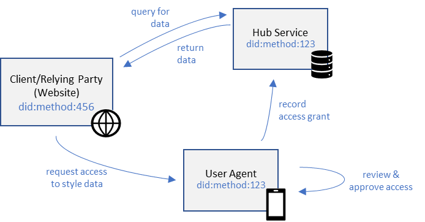
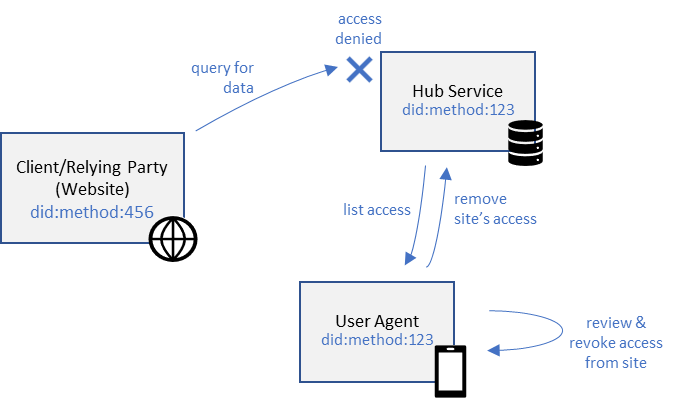
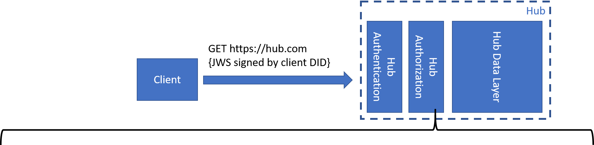
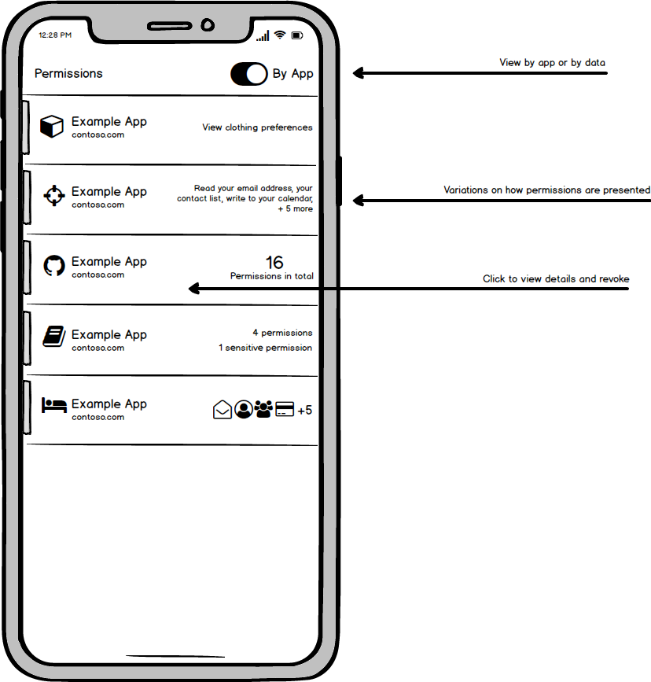

# Identity Hub Permissions/Authorization
The success of a decentralized identity platform is dependent upon the ability for users to share their data with other people, organizations, apps, and services in a way that respects and protects a user’s privacy. In our decentralized platform, all user information & data resides in the user’s identity Hub. This document outlines the basic requirements of the authorization layer for identity Hubs and proposes an initial design that meets these requirements.

## Contents
- Definitions
- A quick primer on authorization
- Scope of this document
- In scope: use cases & requirements
- Out of scope
- Design goals
- 1 | Authorization Model
- 1.1 | Data model
- 1.2 | Granting permissions
- 1.3 | Verifying permissions
- 1.4 | Reviewing & managing permissions
- 1.4.1 | Hub permission management APIs
- 1.4.2 | Permission management experience
- 2 | Authorization Request Protocol
- 2.1 | Data Model
- 2.2 | Onboarding new permissions
- 2.3 | Requesting permissions
- 2.3.1 | Protocol
- 2.3.2 | SDK
- 2.3.3 | User agent consent experience
- 2.4 | Security considerations
- Appendix
- Alternative options considered
- Research on existing authorization systems
- Use cases for future consideration
- Callbacks


## Definitions

**Hub, User Agent:** see supporting docs for an introduction to DIDs.

**User, Identity Owner:** the DID that owns and manages access to all data in a Hub. This document focuses on a human user as the identity owner, but the identity owner could also be an organization, a device, or otherwise.

**Relying Party:** the app, service, or organization that consumes a claim or data from a user’s Hub.

**Trust Provider:** the app, service, or organization that issues a claim or writes data to a user’s Hub.

**Schema Provider:** an entity, organization, or consortium that publishes a schema for data types used by various applications, e.g. schema.org.

**Permission:** describes a set of actions that one DID can take on another DID’s data.

**Permission Grant:** the record that gets created when one DID grants permission to another DID.

**Permission Set:** a logical grouping of permissions that are frequently used together. The scope of the permissions included in the set should be easily understood by a user in a short phrase.

## A primer on authorization

In the context of identity hubs, authorization is the way access to resources (user data) inside a hub is specified and enforced. It can be helpful to distinguish between how authorization is *modeled* and how authorization is *requested.* In existing systems, XACML[[1]](#) (eXtensible access control markup language) is a good example of a model for access control, while OAuth[[2]](#) is the defacto standard framework for requesting access. Wikipedia compares the two nicely:

> **XACML and OAuth**
> OAuth 2.0 is considered to be an authorization standard. It differs from XACML (eXtensible access control markup language) though in its origin, its purpose, and its applications. OAuth is about:
> 
> - delegated access control: I, the user, delegate another user or service access to the resource I own. For instance via OAuth, I grant Twitter (the service) the ability to post on my Facebook wall (the resource).
> - handling the password anti-pattern. Whenever you want to integrate 2 services together, in a traditional, legacy model you have to provide service B with your user credentials on service A so that service B can pretend to be you with Service A. This has many risks of course. Using OAuth eliminates the issues with these patterns and lets the user control what service B can do on behalf of the user with service A.
> - HTTP-based services / resources
> - managing owner (user) approval
> 
> XACML does not handle user approval or delegated access or password management. XACML simply provides:
> 
> - A policy language with which to express a wide range of access control policies including policies that can use consents handled / defined via OAuth.
> - An access control architecture with the notion of a Policy Decision Point (PDP) and a Policy Enforcement Point (PEP).
> 
> XACML and OAuth can be combined together to deliver a more comprehensive approach to authorization. |

We have divided this document into two sections that address each facet of hub authorization:

1. A basic authorization model that allows users to grant access to their data (analogous to XACML).
2. An authorization protocol which allows other DIDs to request access from users (analogous to OAuth).

If you’re familiar with XACML, OAuth, or other authorization systems, the following table may help with terminology:

| **English description**                | **OAuth concept**    | **XACML concept** | **Identity Hub concept** | 
| -------------------------------------- | -------------------- | ----------------- | ------------------------ | 
| who is granted access                  | Client               | Subject           | Client, Relying Party    | 
| who grants the access                  | Resource Owner       |                   | User, Identity Owner     | 
| who holds the resources                | Resource Server      |                   | Identity Hub             | 
| who manages access to resources        | Authorization Server |                   | User Agent               |
| a logical set of resource and actions  | Scope                | PolicySet         | PermissionSet            |
| the resource being accessed            |                      | Resource          | ObjectType               |
| the actions that are allowed           |                      | Action            | Verb (CRUD)              |
| the context in which access is allowed |                      | Environment       |                          |


## Scope of this document

### In scope: use cases & requirements
This proposal is a first cut. The intention is to start simple, and extend the model to include more richness over time. We choose to focus on two simple use cases, described below.

#### Use case 1: Registering for a website

>Alice has added some useful data about her wardrobe style to her Hub: her measurements from her tailor, and a list of her favorite clothing brands. When Alice goes to try out a new online clothing retailer, the retailer’s website allows her to set up an account using her DID. After signing in her DID, the retailer’s website is able to access Alice’s style data. Alice does not have to re-enter her sizes in the site, and the site can give her recommended options based on her brand preferences.



Enabling this use case will require the following from our authorization model:

- as a user, I can add information about myself (measurements, brands) to my hub as a Collections object.
- as a relying party, I can request read access to a logical grouping of data (style choices).
- as a user, I can reliably identify who is requesting access to my info (the retailer).
- as a user, I can easily understand what data is being shared with the relying party.
- as a user, I can choose to accept/deny a request for data.
- as a relying party, I can query data upon user consent.
- as a relying party, I retain access to data so I can periodically retrieve it each time I need to use it.

#### Use case 2: Reviewing & managing access

> Alice learns that one of the websites she visited is making improper use of her personal data. She would like to immediately remove that website’s access to her Hub.



This use case introduces two new requirements:

- as a user, I can view an intuitive list of who has access to my data and what data they can access.
- as a user, I can revoke a third party’s access to my data.


### Out of scope
To be clear, these requirements are not sufficient to consider identity Hubs ready for real world usage. It leaves out several features that have been discussed as being necessary for a minimally viable authorization layer, including[[3]](#):

**Features that control *what* is being granted:**

- How to grant a permission to a specific object by ID, rather than all objects of a certain type.
- How to grant a permission to a property of some object type, rather than the entire object.
- How to grant permission to an object type and all of the children object types in its respective schema.
- How to filter a permission to only:
  - objects created by a specific DID.
  - objects created in a certain time period.
  - objects larger than some byte size.
- How to grant a permission to a zero-knowledge proof of some object, rather than the entire object.
- How to grant permission to act as a delegate of a DID when interacting with other Hubs.

**Features that control *who* is being granted access:**

- How to grant a permission to all DIDs, and therefore make some data public.
- How to create a permission that explicitly denies a DID access to an object.

**Features that limit/expand *where or when* access is granted:**

- How to time-bound permissions, such that a permission expires automatically.
- How to grant permissions to an app on some devices, but not others.

**Features that control *why* access is granted:**

- How an app can specify why permission is being requested.
- How a user can specify why permission is being denied.
- How relying parties and trust providers are reviewed for trustworthiness and integrity.

**Features that are related to Hub authorization, but will be addressed at a later time:**

- How to authenticate requests to the Hub.
- How to request & send callbacks to notify apps of changes to data and permissions in a Hub[[4]](#).
- How to authorize the execution of services, or extensions, in a Hub.
- What format(s) the Hub uses for requests & responses.
- How to encrypt data in a Hub such that the Hub provider cannot access it.

Clearly, there is a large body of functionality that can be added to Hub authorization over time. This is why this initial document intentionally strives to be as simple as possible. We’ll incorporate these things into Hub authorization over time as we receive feedback from early adopters of DIDs.


### Design goals
In designing Hub authorization, we strive to meet the following design constraints:

1. Data in a Hub is 100% data type agnostic – the Hub can support any data type that users and participating apps choose. Data is based on standardized schemas & formats, such that many parties across organizations & industries can interact with the data.
2. Any data in a Hub can be shared with third parties upon consent from the owner.
3. Users can retain fine-grained control over access to their data.
4. Data in a Hub can be grouped into logical permissions that users can easily understand.
5. The set of permissions supported by Hubs should easily expand over time to include new data types, new combinations of data, and new scenarios.
6. Client applications can request access to data from users by sending requests to users via their user agent.
7. Client applications can minimize the access they require upon first use, and can request more access over time.
8. When users are asked to grant access to data, they must be presented with clear, simple, and informative text that helps them understand what access is being requested, by whom, when and for how long.
9. User agents must protect their users from malicious parties that fool users into divulging their data.

# 1. Authorization Model

## 1.1. Data model

The following describes the format of the objects involved in the authorization model.

```
PermissionGrant

{
  "owner": "did:example:12345", // the identity owner (granters)’s DID
  "grantee": "did:example:67890", // the grantee’s DID
  "context": "schemas.clothing.org", // the data schema context
  "type": "measurements", // the data type
  “allow”: “-R--”, // allows create, read, update, and delete
  ... // additional richness & specificity can be added in the future
}
```

> OPEN: Should a grant allow multiple object types to be included? Why or why not?

> OPEN: Should we revert back to using OAuth terminology?

> OPEN: What should we name the “grantee” property?

## 1.2. Granting permissions

When a user grants a permission to another DID, they can do so by specifying the exact objects in the permission grant. When permissions span more than one data type, several PermissionGrant objects can be created. For each PermissionGrant, the following request should be made to the user’s Hub, typically via user agent:

```
{
  iss: 'did:example:12345', // the user’s DID (user sends this request)
  aud: 'did:example:hub',   // the user’s hub’s DID
  aud: 'did:example:12345', // the user’s DID
  "@context": "https://schema.identity.foundation/0.1",
  '@type': 'WriteRequest',

  commit: {
    // protected is the base64url of:
    protected: {
      "interface": "Permissions",
      "context": "schema.identity.foundation/Hub/",
      "type": "PermissionGrant",
      "operation": "create", // update, delete
      "committed_at": "2019-01-16T00:00:00.00:00Z",
      "commit_strategy": "basic",
      "sub": "did:example:12345",
      "kid": "did:example:12345#key-1",
      "meta": {
        "title": "Retailer's tailor measurement permissions"
      }
    },
    // payload is the base64url of:
    payload: {
      "@context": "schema.identity.foundation/Hub/",
      "@type": "PermissionGrant",
      "owner": "did:example:12345",
      "grantee": "did:example:67890",
      "context": "schemas.clothing.org",
      "type": "measurements",
      “allow”: “-R--”
    },
    signature: "signatureOfCommit"
  }
}
```

Note that the Hub Permissions interface only supports the single PermissionGrant object type. The Hub should reject any requests to create objects of other types in the Permissions interface, barring future updates to the PermissionGrant model.

The response format, and any error conditions, should be consistent with all other requests to Hubs. Upon creation of this permission grant object in a user’s Hub, the permission will be propagated to all other Hub instances listed in the user’s DID document via the Hub’s standard sync & replication protocol. This will ensure that all Hub instances are up-to-date with all new permission grants in a timely manner. For details on the Hub object replication protocol, please refer to this document[[5]](#).

## 1.3. Verifying permissions

The following describes the logic implemented by the Hub’s authorization layer when a request arrives.
*Example request to Hub from client application*



1. Receive incoming request from client
2. Determine relevant schema, verb, and client from request
3. Query for all PermissionGrants that whose object_type matches the schema, for the given client DID
4. Check if any query results allow the verb in question
5. Return success/failed authorization check

Note that PermissionGrants do not understand or evaluate the structure of a given schema. For instance, if a user grants access to all “https://schema.org/game” objects, they do not implicitly grant access to all “https://schema.org/videogame” objects (which is a child of game in schema.org’s hierarchy).

## 1.4. Reviewing & managing permissions

### 1.4.1. Hub permission management APIs

Get all permissions granted by a user:

```
// Request
{
  iss: 'did:example:12345', // the user’s DID
  aud: 'did:example:12345', // the user’s DID
  '@type': 'Permissions/Read',
  request: {
    type: 'https://schema.identity.foundation/Hub/PermissionGrant'
  }
}

// Response
{
  '@type': 'Permissions/Read',
  payload: [
    {
      "@type": ‘https://schema.identity.foundation/Hub/PermissionGrant’,
      "grantee": "did:example:67890",
      "object_type": "https://schemas.clothing.org/measurements",
      "allow”: "-R--"
    },
    ...
  ]
}
```

Get all permissions pertaining to a certain object type in the user’s Hub:
```
// Request
{
  iss: 'did:example:12345', // the user’s DID
  aud: 'did:example:12345', // the user’s DID
  '@type': 'Permissions/Read',
  request: {
    'https://schema.identity.foundation/Hub/PermissionGrant'
    filters: [{
      'object_type': 'https://schemas.clothing.org/measurements'
    }]
  }
}

// Response
{
  '@type': 'Permissions/Read',
  payload: [
    {
      "@type": ‘https://schema.identity.foundation/Hub/PermissionGrant’,
      "grantee": "did:example:67890",
      "object_type": "https://schemas.clothing.org/measurements",
      "allow”: "-R--"
    },
    ...
  ]
}
```


Get all permissions pertaining to a certain object in the user’s Hub:
```
// Request
{
  iss: 'did:example:12345', // the user’s DID
  aud: 'did:example:12345', // the user’s DID
  '@type': 'Permissions/Read',
  request: {
    type: 'https://schema.identity.foundation/Hub/PermissionGrant',
    filters: [{
      'object_type': 'https://schemas.clothing.org/measurements',
      'object_id': '4c3f2aa7-2543-41e1-b839-b16f7c746795'
    }]
  }
}

// Response
{
  '@type': 'Permissions/Read',
  payload: [
    {
      "@type": ‘https://schema.identity.foundation/Hub/PermissionGrant’,
      "grantee": "did:example:67890",
      "object_type": "https://schemas.clothing.org/measurements",
      "allow”: "-R--"
    },
    ...
  ]
}
```

Get all permissions pertaining to a client DID:
```
// Request
{
  iss: 'did:example:12345', // the user’s DID
  aud: 'did:example:12345', // the user’s DID
  '@type': 'Permissions/Read',
  request: {
    type: 'https://schema.identity.foundation/Hub/PermissionGrant',
    filters: [{
      'grantee': 'did:example:67890'
    }]
  }
}

// Response
{
  '@type': 'Permissions/Read',
  payload: [
    {
      "@type": ‘https://schema.identity.foundation/Hub/PermissionGrant’,
      "grantee": "did:example:67890",
      "object_type": "https://schemas.clothing.org/measurements",
      "allow”: "-R--"
    },
    ...
  ]
}
```
> OPEN: How do you filter a permissions query down to only certain objects in Hub syntax? Is the above correct?

### 1.4.2. Permission management experience
Note, all mocks are for illustrative purposes only.

| Manage permissions by app/DID | Manage permissions by data type |
| ---- | --- |
|  |  |
 


# 2. Authorization Request Protocol

## 2.1. Data Model

Our authorization protocol is a minor extension of the DID authentication protocols[[6]](#) that standardizes the authorization of data access. It introduces the concept of a PermissionSet, which is analogous to a scope in OAuth. PermissionSets serve three purposes:

1. They offer a way for client developers to request permission from users to access a related set of objects. We assert that a logical permission to a user will often be comprised of many types of data – not a single data type.
2. They allow PermissionGrants to be specified by reference in authorization requests, instead of having to include the full details. This reduces the length of authorization requests significantly.
3. They provide a place from which to serve localized user-friendly strings to be used in consent screens. This makes it easy for user agents to add support for new permissions as they arise, without needing to update their app.
4. They give developers a re-usable set of permissions to choose from, rather than requiring every developer define their own permissions.

A permission set is defined by the following two objects:

```
PermissionSet // defines a group of permissions that can be requested by a client

{
  // the set of PermissionGrants that this permission includes
  “permissions”: [ 
    {
      “object_type”: “https://schemas.clothing.org/measurements”
      “allow”: “-R--”,
      ...
    },
    {
      “object_type”: “https://schemas.clothing.org/brandPreferences”
      “verbs”: “-R--”
      ...
    }
  ]

  // the value used in authorization reqeusts
  “name”: “Hub://did:example:abc123/permissions/sets/style/v1.0”,

  // pointer to strings and icons to be used by user agents
  “resourceBundle”: “Hub://did:example:abc123/permissions/sets/style/v1.0”
}
```

```
PermissionSetResourceBundle // exposes strings for user agents to use

{
  “language”: “en-us”,

  // displayable text for user agents
  “consent_string_short”: “View your clothing preferences”,
  “consent_string_long”: “Read your sizes...including...and your...favorite brands”

  // a recommended icon to display to users
  “icon”: “/resources/clothing.ico” 
}
```

> OPEN: Should the PermissionSet name above include a hash of the PermissionSet object? That way, should the definition of the PermissionSet change, user agents can take action. Should the hash just replace /style/v1.0 in the name?

## 2.2. Onboarding new permissions

The process for onboarding a new PermissionSet for use by client developers proceeds as follows.

1. A developer, an organization, a consortium, or other group of DID ecosystem participants agree upon a set of data format(s) to be used in their respective industry or application. They might publish their schemas, but doing so is not required.
2. The parties agree upon reasonable permission sets that allow client developers to request access to the data types from users. Each set must contain at least one PermissionGrant, but may contain more. The parties choose a DID used to define their PermissionSets.
3. Each PermissionSet is then exposed in that DID’s Hub, at the exact location specified by the “name” property of the PermissionSet. PermissionSets are public objects in Hubs, they do not require authentication or authorization to access.

```
{
  aud: 'did:example:abc123', // the defining DID
  '@type': 'Permissions/Read',
  request: {
    type: 'https://schema.identity.foundation/Hub/PermissionSet',
    path: '/style/v1.0'
  },
  payload: [
    {
      data: {
        "@type": "https://schema.identity.foundation/Hub/PermissionGrant",
        "permissions": [...]
        "name": "Hub://did:example:abc123/permissions/sets/style/v1.0",
        "resourceBundle”: "..."
      }
    }
  ]
}
```

4. The parties then create recommended strings that user agents should use for the set. Each string can be optionally localized into languages relevant to the industry or application. All resources are in the Hub at a location constructed by concatenating the resource bundle from the permission set definition above and a language tag:

```
{
  aud: 'did:example:abc123', // the defining DID
  '@type': 'Permissions/Read',
  request: {
    type: 'https://schema.identity.foundation/Hub/PermissionSetResourceBundle',
    path: '/style/v1.0/en-us'
  },
  payload: [
    {
      data: {
        "@type": 'https://schema.identity.foundation/Hub/PermissionSetResourceBundle',
        "language": "en-us",
        "consent_string_short": "View your clothing preferences",
        "consent_string_long": "Read your sizes...including...and your...favorite...",
        “icon”: “/resources/clothing.ico” // a recommended icon to display to users
      }
    }
  ]
}
```

> OPEN: Is the “path” in the above request the right way to model such a query in hub syntax?

5. The definers of the PermissionSet can then publish developer documentation that describes when and how to use the permission. Developers can use this documentation to decide which PermissionSet(s) minimize the access they request from users.
6. If a developer should want a new permission set to be created, they can define their own, or work with a trusted entity to add a new PermissionSet to their DID.

## 2.3. Requesting permissions

### 2.3.1. Protocol 
The following describes the process by which a client application requests permissions from a user via their user agent. This process is an addition to the proposed DID auth protocols[[7]](#).


1. Optionally, a client developer can use a helper SDK to form their permission requests.
2. The client forms a JWT with the following structure, indicating the desired PermissionSets:

```
{jwt-header}.
{
  “iss”: “did:example:67890”, // from DID auth spec
  “callback”: ..., // from DID auth spec
  “nonce”: ..., // from DID auth spec
  ...
  “requested”: [ // list of PermissionSets requested, by name
    “Hub://did:example:abc123/permissions/sets/style/v1.0”
  ] 
}
.{jwt-signature}
```

3. The client sends the permission request to the user agent via one of the transports described in DID authentication documents. Some examples include:
  - The client app may present a QR code, which is then scanned by a mobile user agent.
  - If the client app and user agent are on a single device, it can use an OS custom URI scheme.
  - If the user’s DID is known ahead of time, the client can send a permission request to the user’s Hub:

```
{
  iss: 'did:example:67890', // the client’s DID
  aud: 'did:example:12345', // the user’s DID
  '@type': 'Action/Create',
  request: {
    type: “https://schema.identity.foundation/Hub/PermissionRequestAction”
  },
  payload: [
    {
      data: {
        “@type”: “https://schema.identity.foundation/Hub/PermissionRequestAction”,
        "request": "eyJhbGciOiJIUzI1NiIsInR5cCI6IkpXVC...", // the jwt from above
      }
    }
  ]
}
```

In this case, user agents can then retrieve incoming permission requests from the user’s Hub and present them to the user. After a request is processed, user agents should delete the PermissionRequestAction from the Hub. Note that creating an action in a user’s Hub does not require generally authorization.


4. The user agent validates the incoming JWT and extracts the client’s DID.
5. The user agent extracts the requested PermissionSet(s) from the JWT.
6. The user agent fetches the PermissionSet definition:

```
{
  aud: 'did:example:abc123', // the defining DID
  '@type': 'Permissions/Read',
  request: {
  type: 'https://schema.identity.foundation/Hub/PermissionSet',
    path: '/style/v1.0'
  },
  payload: [
    {
      data: {
        "@type": "https://schema.identity.foundation/Hub/PermissionGrant",
        "permissions": [...]
        "name": "Hub://did:example:abc123/permissions/sets/style/v1.0",
        "resourceBundle”: "..."
      }
    }
  ]
}
```

7. If no matching permission set is found, fail the permission request with an error message (see below).
8. The user agent loads relevant localized UI strings from its own storage, if they exist for this PermissionSet.
9. If the user agent doesn’t have its own strings for this PermissionSet, it fetches the recommended strings:

```
{
  aud: 'did:example:abc123',
  '@type': 'Permissions/Read',
  request: {
    type: 'https://schema.identity.foundation/Hub/PermissionSetResourceBundle',
    path: '/style/v1.0/en-us'
  },
  payload: [
    {
      data: {
        "@type": 'https://schema.identity.foundation/Hub/PermissionSetResourceBundle',
        "language": "en-us",
        "consent_string_short": "View your clothing preferences",
        "consent_string_long": "Read your sizes...including...and your...favorite...",
        “icon”: “/resources/clothing.ico” // a recommended icon to display to users
      }
    }
  ]
}
```
> OPEN: Should we instead use the OAuth Dynamic Client Registration scheme for internationalization? ([section 2.2 of this doc](https://tools.ietf.org/html/rfc7591))? Are there fallback languages if a language is not found? Does “en” map to “en-us”? There’s a fair bit of detail in internationalization which is not covered here. Should we just call it out of scope for this doc?

10. If no acceptable strings are found, fail the request with a standard error message (see below).
11. The user agent displays a consent prompt to the user (see below).
12. The user can review permissions and accept the request. If the user denies, fail the request with an error message.
13. The user agent constructs the PermissionGrant(s) and writes them to the user’s Hub:

```
{
  iss: 'did:example:12345', // the user’s DID
  aud: 'did:example:12345', // the user’s DID
  '@type': 'Permissions/Create',
  request: {
    type: ‘https://schema.identity.foundation/Hub/PermissionGrant’
  },
  payload: [
    {
      data: {
        "@type": ‘https://schema.identity.foundation/Hub/PermissionGrant’,
        "grantee": "did:example:67890", // the grantee’s DID
        "object_type": "https://schemas.clothing.org/measurements",
        "allow”: "-R--", // allows create, read, update, and delete
      }
    }
  ]
}
```

```
{
  iss: 'did:example:123abc',
  aud: 'did:example:12345',
  '@type': 'Permissions/Create',
  request: {
    type: ‘https://schema.identity.foundation/Hub/PermissionGrant’
  },
  payload: [
    {
      data: {
        "@type": ‘https://schema.identity.foundation/Hub/PermissionGrant’,
        "grantee": "did:example:67890",
        "object_type": "https://schemas.clothing.org/brandPreferences",
        "allow”: "-R--",
      }
    }
  ]
}
```


14. The user agent returns a response to the indicated callback, via one of the transports described in the DID authentication documents. Where appropriate, the user may be redirected to the callback location as well. Some examples of transports include:
  - Sending an HTTP POST request back to the callback URL specified in the request.
  - Opening a URL with an OS specific custom scheme specified in the request.

The contents of the response include a JWT with the following structure:

```
{jwt-header}.
{
  “iss”: “did:example:12345”, // from DID auth spec
  “aud”: “did:example:67890”, // from DID auth spec
  “nonce”: ..., // from DID auth spec
  ...
  “granted”: [ // list of permission sets granted in this request
    “Hub://did:example:abc123/permissions/sets/style/v1.0”
  ]
}
.{jwt-signature}
```

In the event that an error occurs during the processing of the permission request, the response JWT may contain an error claim with one or more errors:

```
{jwt-header}.
{
  “iss”: “did:example:12345”, // from DID auth spec
  “aud”: “did:example:67890”, // from DID auth spec
  “nonce”: ..., // from DID auth spec
  ...
  “permission_errors”: [
    {
      “error”: “access_denied”,
      “error_code”: “ua-12345”
    }
  ],
}
.{jwt-signature}
```

Permission related errors are included in their own claim so that an attempt to authenticate a user with their DID request might still succeed, even though the requested permissions have been denied.

> OPEN: if permissions are denied, should the entire authentication request fail? Is the ability to authenticate/sign-in/disclose a DID modeled as a permission? In other words, can a DID auth-flow complete without at least once “disclose” permission being granted to the requestor?

The user agent can choose from the following set of recommended *error*s (which come from OAuth), and may introduce new errors as necessary.


| access_denied      | The user denied the request.                                                                                                                      |
| ------------------ | ------------------------------------------------------------------------------------------------------------------------------------------------- |
| invalid_request    | The request is missing a required parameter, includes an invalid parameter value, includes a parameter more than once, or is otherwise malformed. |
| invalid_permission | The requested permission is invalid, unknown, or malformed.                                                                                       |


The *error code* field is a non-standard string provided by the user agent that allows user agents to give developers greater detail about the reasons for an error that occurs. The accepted length of the *error code* field should be long enough to allow user agents to include a short URL to documentation about specific error codes.


### 2.3.2. SDK
The following is an API proposal for an example Android SDK which supports the requesting of permissions from a DID via their user agent. This is an example topology in which the custom scheme URI might be used to transport the permission request.

```
// set up SDK
String myDid = “did:example:12345”;
DIDClient client = DIDClient(myDid);
client.sign = new MyDidSigner(); // function to sign a request using app’s private key

// request permissions
String[] permissions = {"https://schemas.clothing.org/.permissions/style"};
Intent request = client.getPermissionRequestIntent(context, permissions);
client.getPermissionRequestResult(resultCode, request, new MyPermissionRequestHandler());

// implement callback handler
class MyPermissionRequestHandler implements DidCallback
{
  public void handleException(Exception exception)
  {
    // handle exception appropriately
  }

  public void handleResult(PermissionRequestResult result)
  {
    DIDDocument user = result.getDidDocument();
    DIDPermission[] granted = result.getGrantedPermissions();

    // check if necessary permissions were granted, then take action
  }
}

// implement signing function
class MyDidSigner implements DidSigner
{
  public string signRequest(string serializedPermissionRequest)
  {
    // sign request using app’s private key
  }
}
```

### 2.3.3. User agent consent experience
The following is an example of how the user agent’s consent experience could be rendered. Note all mocks in this document are for illustrative purposes only.


> OPEN: What is the standard for specifying app logo/name? How is the identity for app verified? These are both important questions that have not been specified in this doc yet. Should they be brought into scope for this doc?

## 2.4. Security considerations

Because any DID can define a PermissionSet, user agents must take care to verify that the descriptions they display to users in consent dialogs accurately represent the access being granted. If user agents naively display the recommended strings defined in a PermissionSet, an attacker could easily define its own PermissionSet with dishonest descriptions.

For this reason, user agents must employ logic to determine if a DID (and therefore the PermissionSets it defines) is trustworthy. Some user agents may choose not to display any text but their own. If user agents choose not to trust a PermissionSet definition, they should not fail the request. Instead, they should take care to warn the user of potential attack, and make their best effort to ensure the user’s data remains safe.

# Appendix

## Alternative options considered

**How to present user-friendly UI strings in user agent consent dialogs**

|   | Description                                                                                                                                                                                                                                                                                                                                                                                                                                                                                                                                    | Pros                                                                                                                                                                                                                                                                                                                                                                                           | Cons                                                                                                                                                                                                                                                                                                                                                                                                                                                                          |
| - | ---------------------------------------------------------------------------------------------------------------------------------------------------------------------------------------------------------------------------------------------------------------------------------------------------------------------------------------------------------------------------------------------------------------------------------------------------------------------------------------------------------------------------------------------- | ---------------------------------------------------------------------------------------------------------------------------------------------------------------------------------------------------------------------------------------------------------------------------------------------------------------------------------------------------------------------------------------------- | ----------------------------------------------------------------------------------------------------------------------------------------------------------------------------------------------------------------------------------------------------------------------------------------------------------------------------------------------------------------------------------------------------------------------------------------------------------------------------- |
| A | When asking the user for permissions, client applications specify in requests the full schema of the objects they need to access. It is up to user agents to do their best to try and infer the proper UI strings from the structure of a permission request. User agents should never fail a request due to an unexpected/unknown object specified.                                                                                                                                                                                           | - Very easy for new objects & permissions to be introduced to Hubs. Client apps can just request access to whatever schema they require, and it should work.                                                                                                                                                                                                                                   | - User agents can hard-code friendly strings for commonly used objects, but must fall back to presenting raw schema URIs to users. Raw schema URIs are unintuitive & difficult to localize. Users will not gain a good understanding of what access is being requested.<br />- Permission requests become very long & verbose – we’ve had problems in the past with request length limits on certain platforms.                                                                    |
| B | Each user agent independently defines a set of permissions that client developers can request and publishes its supported permissions online. User agents define the localized UI strings for these permissions. User agents might coordinate on a commonly used set of permissions, but there is no standard for what a user agent must support. Client developers can then choose which permissions to use based on which user agents they want to target. User agents fail a permissions request if an unsupported permission is requested. | - All UI strings presented to users are defined by user agents. In this way, users only need to trust their UA to behave honestly. UAs who behave poorly will lose out to UAs who provide clear, honest representations of how data is accessed.                                                                                                                                               | - Forces developers to reason over UA support for permissions. Not all UAs may support the same set of permissions.<br />- Some UAs may disagree over the meaning of a permission. Developers might then get access to different objects depending on which UA the user users, and end up coding their app to be UA-specific.<br />- Onboarding a new permission/object type requires convincing UAs to add support for that permission. This could take significant time & discussion. |
| C | The publisher of a schema (a schema provider) also publishes a set of permissions along with their schemas. Each permission therefore belongs to an organization, and is part of that organization’s namespace. These permissions include recommended localized UI strings that user agents can use, but user agents can also override with their own strings for commonly used permissions. If a user agent does not find strings published with a permission, it fails the request.                                                          | - It’s up to specific industries & companies to organically arrive at the set of permissions and schemas most commonly used. Onboarding a new permission/object does not involve standards bodies or technology providers.<br />- User agents can present friendly UI strings without having to ship changes every time a new permission is added.                                                  | - Consensus on commonly used permissions may be difficult to achieve. Who gets to decide the world’s “profile” permission, for instance?<br />- A permission can’t span objects in different schemas. All objects that are included in a permission must be schematized by the same organization.<br />- Users place trust in schema providers to honestly describe the scope of access being granted.                                                                                  |
| D | A discrete set of permissions that are supported in the DID ecosystem are agreed upon and defined by standards bodies. Standards bodies publish recommended localized strings for these permissions, but UAs can override them as they wish. If a permission request includes a non-standard permission, the UA must fail the request.                                                                                                                                                                                                         | - User agents have a discrete set of permissions to support at any point in time, making it easier to build high quality consent experiences.<br />- There is a central list of permissions that developers can browse when learning to code DID supporting apps.<br />- Permissions can be given short, friendly names that save space in requests.<br />- Permissions can span objects in multiple schemas. | - Onboarding a new permission/object type requires interfacing with a standards body. The standards body retains the power to define what permissions can/can’t be requested.<br />- It may be difficult for standards bodies to facilitate agreement between parties on the right permissions to adopt.<br />- Users place trust in standards bodies to honestly describe the scope of access being granted.                                                                           |
| E | When asking the user for permissions, client applications specify in requests the full schema of the objects they need to access, as well as the localized strings that should be presented in consent pages.                                                                                                                                                                                                                                                                                                                                  |                                                                                                                                                                                                                                                                                                                                                                                                | - Users place trust in client apps to honestly describe the scope of access being requested.<br />- It’s extraordinarily easy for client apps to lie about what access they are requesting.                                                                                                                                                                                                                                                                                        |


## Research on existing authorization systems

### Node accesscontrol
Is a pretty dead simple JSON based system that allows you to:

- define roles and resources (objects)
- define hierarchical roles that inherit abilities of other roles
- grant CRUD access to objects
- filter down access to property level
- distinguish between "all" objects and "owned" objects
- doesn't actually create grants, just the role definitions
- you keep a table of users -> roles and then check if a role has an ability at runtime
- all definitions are kept in memory

Example definitions of roles:

```
// grant list fetched from DB (to be converted to a valid grants object, internally) 
let grantList = [ 
  { role: 'admin', resource: 'video', action: 'create:any', attributes: '*, !views' }, 
  { role: 'admin', resource: 'video', action: 'read:any', attributes: '*' }, 
  { role: 'admin', resource: 'video', action: 'update:any', attributes: '*, !views' }, 
  { role: 'admin', resource: 'video', action: 'delete:any', attributes: '*' }, 
  { role: 'user', resource: 'video', action: 'create:own', attributes: '*, !rating, !views' }, 
  { role: 'user', resource: 'video', action: 'read:any', attributes: '*' }, 
  { role: 'user', resource: 'video', action: 'update:own', attributes: '*, !rating, !views' }, 
  { role: 'user', resource: 'video', action: 'delete:own', attributes: '*' } 
]; 
const ac = new AccessControl(grantList);
```

Reasons access-control does/doesn't make sense for us to use:

- It's pretty limited in what it can do, e.g. only supports simple resource objects
- It doesn't really define a request protocol, only a role definition format

### XACML
XACML is a policy languange based on XML for evaluating access requests. It consists of PolicySets, Policies, and Rules. Each of these refer to the following roles:

- Subject
- Resource
- Action
- Environment

It then tacks on advanced authorization logic like Conditions, Obligations, and Targets.

A JSON version of a XACML access request might look like:

```
{
    "Request": {
        "AccessSubject": {
            "Attribute": [
                {
                    "AttributeId": "com.acme.user.employeeId",
                    "Value": "Alice"
                }
            ]
        },
        "Resource": {
            "Attribute": [
                {
                    "AttributeId": "com.acme.record.recordId",
                    "Value": "123"
                },
                {
                    "AttributeId": "com.acme.object.objectType",
                    "Value": "record"
                }
            ]
        },
        "Action": {
            "Attribute": [
                {
                    "AttributeId": "com.acme.action.actionId",
                    "Value": "view"
                }
            ]
        },
        "Environment": {
            "Attribute": []
        }
    }
}
```

Reasons XACML does/doesn't make sense for us to use:

- See above description on XACML vs. OAuth. Our immediate problems are much more akin to OAuth.
- XACML seems to be a bit more expressive/powerful than we need, though over time we may wish to incorporate some of this power.
- It's pretty much just a data format, not really a request/response protocol
- It's XML based, though there are JSON implementations out there
- Again, looks like more headache than it's worth at this time.

### User Managed Access (UMA)
UMA 2.0 Grant defines a new OAuth grant type, which does two main things:

- Enables a resource owner to grant access to another human (requesting party) using an app, rather than just granting access to an app.
- Enables a resource owner to set up policies that allow for auto-consent grants, rather than requiring in-the-moment synchronous consent.

UMA Federated Authorization decouples the authorization server from the resource server, so that one central authorization server can be used to secure many different types of resources, all using the same model.
UMA-enabled systems can respect policies such as…

- When a person driving a vehicle with an unknown ID comes into contact with my Solar Freakin’ Driveway, alert me and require my access approval.
- Only let my tax preparer with email TP1234@gmail.com and using client app TaxThis access my bank account data if they have authenticated strongly, and not after tax season is over.
- Let my health aggregation app, my doctor’s office client app, and the client for my husband’s employer’s insurance plan (which covers me) get access to my wifi-enabled scale API and my fitness wearable API to read the results they generate.

UMA implementations typically use XACML, but it's not technically required. It also integrates nicely with OpenID Connect, thought that's not enforced either.

Basic steps in the UMA flow:

1. Client requests access to resource w/o an access token
2. Resource server gets a "permission ticket" from the authorization server
  1. A permission ticket is a set of permissions, a permission is a set of scopes at a particular resource
  2. Which permissions are included in the permission ticket is up to the resource server to determine
3. Resource server returns permission ticket to client in WWW-Authenticate header
4. Client requests a "requesting party ticket" (RPT) (access token) from authorization server
  1. Client can hit token endpoint with permission ticket and optional "claim token", and optional "persisted claim token"
    1. A claim token is like an id_token or SAML assertion
    2. A persisted claim token is a token issued by the authorization server that represents previously validated claims
5. Authorization server returns an error to client with a "need_info" error code
6. Client redirects requesting party to "claims interaction endpoint", which performs claims gathering processes such as:
  1. Account registration/authentication to the authorization server as an identity provider
  2. Filling out a form
  3. Redirection or queries to another system to verify data/claims about the requesting party
7. Authorization server redirects requesting party back to client with new permission ticket
8. Client repeats step 4, asking for an RPT using its permission ticket, claim token, and persisted claim token
9. Authorization server evaluates the request against policies configured by the resource owner
10. Authorization server returns an RPT to the client, along with a PCT if appropriate
11. Client sends RPT to resource server as a bearer token

Details on how you might implement this flow are provided in the UMA FedAuthZ spec:
The UMA resource description is pretty much exactly what is described in this document:

```
{  
   "resource_scopes":[  
      "view",
      "http://photoz.example.com/dev/scopes/print"
   ],
   "description":"Collection of digital photographs",
   "icon_uri":"http://www.example.com/icons/flower.png",
   "name":"Photo Album",
   "type":"http://www.example.com/rsrcs/photoalbum"
}
```

But they also have a scope description which defines the resources for a scope in the above:

```
{
  "description":"Print out and produce PDF files of photos",
  "icon_uri":"[http://www.example.com/icons/printer](http://www.example.com/icons/printer)",
  "name":"Print"
}
```

Then, when a resource provider wants to issue a permissions ticket based on a query, it requests one from the authorization server using the resource ID (from the resource description creation request) and the scopes allowed for that resource:

```
HTTP POST
{
  "resource_id":"112210f47de98100",
  "resource_scopes":[
    "view",
    "[http://photoz.example.com/dev/actions/print](http://photoz.example.com/dev/actions/print)"
  ]
}
```

Reasons UMA does/doesn't make sense for us to use:

- Kind of assumes REST style, but could be adapted
- Kind of assumes authorization server is a server, not a mobile app (user agent)
- Really sets out to solve a different problem - the problem of granting access to people, not to apps/service
- We may eventually have such a problem, and want to adopt their protocol
- Has a nice resource/scope definition that we are very close to already, might borrow that
- Not any real implementations out there to use, seems like it would be more difficult than roll-your-own

### Azure RBAC
Core concepts:

- Security Principals (User, Group, Service Principal)
- Role Definition
  - Permissions
  - Actions- {Company}.{ProviderName}/{resourceType}/{action}, e.g Microsoft.Authorization/*/Delete, Microsoft.Compute/virtualMachines/*
  - NotActions - subtract from actions, not explicitly deny
  - DataActions - used for separating management authZ from data authZ, e.g. Microsoft.Storage/storageAccounts/blobServices/containers/blobs/read
  - NotDataActions - substract from data actions
- Scope - ManagementGroup/Subscription/ResourceGroup/Resource
- Role Assignment
  - Security Principal + Role Definition + Scope

Q: How does onboarding a new operation work? In the non-Azure case? 
A: There's a portal in which a company owner can come and add new operations for their providers

Q: How does onboarding a new role definition work?
A: Customers can define custom roles via the portal, powershell, CLI, etc.

Q: So a grant records a scope, roledef, and princpal, right. Why not include the roledef in the grant itself?
A: So that we can re-use roledefs over and over again without re-stating them, and change them in-place if necessary

Reasons Azure RBAC does/doesn't make sense for us to use:

- It's not open source, although we might be able to open source it
- Kind of assumes there is a resource provider who onboards a provider and their actions, as opposed to a hub with baked in CRUDX
- We don't really have management scope yet, everything is just a flat file\

## Use cases for future consideration

The following use cases are not met by this proposal – they require advanced features that have not been included. Each use case, and the features required to meet it, should be considered in future additions to the Hub authorization layer.

### Use case 3: Public search for DIDs

> Alice uses a new DID based social media application. To use the app, she must to send friend requests to her contacts. Within the app, she searches for her friends using names as a search term, and might further qualify her searches using education or employment history.

New requirements for this case include:

- as a user, I can make certain data public by granting permission for all DIDs to read it.
- as a relying party, I can crawl DIDs to create a searchable index of DID profile data.

### Use case 4: Lightweight registration for a website

> Alice wants to create an account with a news site, which allows her sign up using her DID. All that is required to access the news site is an email address. Upon signing up with her DID, the website requests access to Alice’s email address, which is part of Alice’s profile. However, the site does not receive access to the rest of Alice’s profile.

New requirements for this case include:

- as a relying party, I can request access to read a subset of data in an object, rather than the entire object.

### Use case 5: Sharing a verified claim

> To apply for a job online, Alice needs to provide proof of her graduation from university. Thankfully her university allows her to link her DID to her student account and receive a digital diploma. After authenticating Alice’s DID, the university signs a digital diploma and writes the attestation to Alice’s Hub. Alice then applies for a job online with her DID, and the employer’s website is able to access her Hub and check for a signed proof of graduation.

New requirements for this case include:

- as a relying party, I can request data from a user that is verified by some third party
- as a trust provider, I retain CRUD access to any attestation that I create in the user’s Hub, but cannot read or access attestations created by any other party. This allows me to:
  - check on the status of an attestation that I issued
  - revoke an attestation if I deem it invalid later on
  - re-issue/re-verify attestations over time if they expire/become invalid

### Use case 6: Sharing specific information for legal compliance

> Alice visits the Whole Foods website, which allows her to purchase groceries for delivery from the local store. Alice wishes to buy alcohol with her groceries, which requires age verification. The Whole Foods website allows Alice to prove her age via her DID – however, her age and delivery address must be confirmed by the state DMV to do so. Alice, wanting to minimize her data exposure, does not disclose her birthdate, but only the DMV verified fact that she is over 21. She also chooses to only allow Whole Foods access to her current shipping address, rather than all of the previous residences associated with her DID. |

New requirements for this case include:

- as a relying party, I can request an attestation verified by a specific 3rd party
- as a user, I can share meta-attestations without sharing all my attestations (zero-knowledge proofs)
- as a user, I can disclose a specific object to a relying party, rather than all objects of a certain type

### Use case 6: Sharing collections of data

> Alice is collaborating with fellow students at her university on a group project. The group uses a DID based document storage solution that is akin to Dropbox. All documents and files for their project are store in Alice’s Hub, and are organized into a specific folder she created. In order to collaborate, she grants her team access to only the files contained in this folder. She does not want her team to access all documents and files in her Hub, nor does she want to share out each file individually.

New requirements for this case include:

- as a user, I can grant access to a specific group of objects, rather than all objects or one specific object.

### Use case 7: Sharing classes of verified information

> Alice wants to sign up as a dog-sitter for a task-fulfilling service. She uses a website to enlist as a willing dog-sitter, but struggles to get any clients, since she has no previous reviews on the site. Instead, she can provide other assurance to potential clients by linking her DID to the website. The website is then able to access Alice’s verified proof of employment, and her verifiend proof of completion of a dog training course from a local school.

New requirements for this case include:

- as a relying party, I can request the class of attestation that fulfills my needs, rather than a specific data type. The data types in the class might be related by the structure of some schema.
- as a relying party, I can request data that is verified by a 3rd party with a high trust score, so that I do not fall victim to trusting fraudulent verifications

### Use case 8: Improving relying party experiences

> A developer of a site supporting DIDs wants to build a delightful experience for Alice. However, doing so is currently difficult for several reasons. Alice is scared by the many permissions the site requests and can’t easily recognize the site’s branding in her user agent. Making matters worse, integration with DIDs is so difficult that delivering DID support in the site has slipped for months.

New requirements to address these shortcomings include:

- as a relying party, I can request reusable permission sets instead of long lists of permissions
- as a relying party, I can specify mandatory data that the user must provide before entering my site (accrual)
- as a relying party, I can easily support GDPR & right to be forgotten
- as a relying party, I can provide a branded user experience for users signing up/into my app
- as a relying party, I can provide reasons for why I am requesting certain permissions
- as a relying party I can receive attestations in the token/response rather than making queries
- as a relying party, I can add DID support with minimal effort & maximum support

### Use case 9: Impersonating the user in inter-Hub scenarios

> Alice signs up for a new to-do list app that stores tasks in her Hub. The app allows Alice to assign tasks to friends & family and remind them when their tasks are due. The app sends automated reminders on Alice’s behalf, such that Alice’s family sees reminders are coming from Alice herself.

New requirements to enable such an app are:

- as a relying party, I can request the ability to impersonate Alice in a limited capacity.
- as a user, I can understand when, where, and why a relying party is impersonating me to other users.
- as a relying party, I can send messages to other Hubs using a credential that is linked back to the user.

### Use case 10: Sharing time-based subsets of data

> Alice has become part of a legal investigation, and wants to help provide evidence to authorities. To assist with the investigation, Alice wishes to share her call and message records from April-June of this year. However, she doesn’t wish to disclose any records beyond the time period that is relevant for the investigation.

New requirements to enable this case are:

- as a user, I can share a subset of data based on the time in which that data was created in my Hub.

### Use case 11: Granting access to actions, rather than data

> Alice purchases a home security system that includes digitally controlled locks for her doors. When setting up the system, Alice was able to associate each lock with her DID, such that all operations of the system can be done via her Hub. Alice is now leaving for vacation, and wants to give a friend access to her home for the weekend. She wants her friends access to expire automatically when she returns from vacation.

New requirements to enable this case are:

- as a relying party, I can expose my services through a user’s Hub, so that users can manage access to my services just like they manage access to their personal data.
- as a user, I can grant access to other users to operate services in my Hub.
- as a user, I can specify a time period for which access should remain valid.


## Callbacks

When developing against identity Hubs, developers will want their apps and services to stay aware of changes to user data over time. For instance, if a user updates their email address in their identity Hub’s profile, an application will want to update its local copy used for communication with the user.

With the current proposal, doing so would require apps to query all Hubs periodically to check for changes to data they are interested in. A better model would be to allow apps and services to register a callback or webhook that can be pinged when certain data in a user’s Hub changes. This will prevent unnecessary traffic to Hubs.

Our early thinking is that callbacks could be included as an extension of our authorization model. For instance, an application could register for a callback by requesting the following permission:

```
PermissionGrant

{
  "owner": "did:example:12345",
  "did": "did:example:67890",
  "object_type": “https://schemas.clothing.org/measurements”,
  "allow": "-R--",
  "callbacks": [
    {
      "events": "C-UD",
      "uri": {callback-uri},
      "headers": {desired-header-values}
    }
  ]
}
```
A PermissionGrant with this callback configuration would send callback messages any time an object of type “https://schemas.clothing.org/measurements” is created, updated, or deleted.

We’ve also considered modeling callbacks separately from permissions. However, there is an important connection between permissions and callbacks: the rules from the authorization model should apply to callbacks just as they apply to regular Hub queries. More concretely, a third party should not be able to register or receive a callback if they do not have at least the “read” permission for the given object type.

1. [https://en.wikipedia.org/wiki/XACML](https://en.wikipedia.org/wiki/XACML) [↑](#)
2. [https://oauth.net/2/](https://oauth.net/2/) [↑](#)
3. See [appendix](#) for recommendations on future work [↑](#)
4. See [appendix](#) for early thoughts on callbacks [↑](#)
5. TODO: link [↑](#)
6. [DID Auth documents](https://github.com/WebOfTrustInfo/rebooting-the-web-of-trust-spring2018/blob/master/final-documents/did-auth.md) [↑](#)
7. [DID Auth documents](https://github.com/WebOfTrustInfo/rebooting-the-web-of-trust-spring2018/blob/master/final-documents/did-auth.md) [↑](#)

