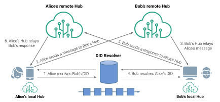

Identity Hub
==================

**Specification Status:** Draft

**Latest Draft:**
  [identity.foundation/identity-hub/spec](https://identity.foundation/identity-hub/spec)
<!-- -->

**Editors:**
~ [Daniel Buchner](https://www.linkedin.com/in/dbuchner/) (Block)
~ [Tobias Looker](https://www.linkedin.com/in/tplooker) (Mattr)

**Contributors:**
~ [Henry Tsai](https://www.linkedin.com/in/henry-tsai-6b884014/) (Microsoft)
~ [XinAn Xu](https://www.linkedin.com/in/xinan-xu-b868a326/) (Microsoft)
~ [Moe Jangda](https://www.linkedin.com/in/moejangda/) (Block)

**Participate:**
~ [GitHub repo](https://github.com/decentralized-identity/identity-hub)
~ [File a bug](https://github.com/decentralized-identity/identity-hub/issues)
~ [Commit history](https://github.com/decentralized-identity/identity-hub/commits/master)

------------------------------------

## Abstract

Most digital activities between people, organizations, devices, and other entities 
require the exchange of messages and data. For entities to exchange messages and 
data for credential, app, or service flows, they need an interface through which 
to store, discover, and fetch data related to the flows and experiences they are 
participating in. Identity Hubs are a data storage and message relay mechanism 
entities can use to locate public or private permissioned data related to a given 
Decentralized Identifier (DID). Identity Hubs are a mesh-like datastore construction 
that enable an entity to operate multiple instances that sync to the same state across 
one another, enabling the owning entity to secure, manage, and transact their data 
with others without reliance on location or provider-specific infrastructure, 
interfaces, or routing mechanisms.

## Status of This Document

Identity Hub is a _DRAFT_ specification under development within
the Decentralized Identity Foundation (DIF). It incorporates requirements and
learnings from related work of many active industry players into a shared
specification that meets the collective needs of the community.

The specification will be updated to incorporate feedback, from DIF members and 
the wider community, with a reference implementation being developed within DIF 
that exercises the features and requirements defined here. We encourage reviewers 
to submit [GitHub Issues](https://github.com/decentralized-identity/identity-hub/issues) 
as the means by which to communicate feedback and contributions.

## Terminology

[[def:Identity Hub]]
~ A decentralized personal and application data storage and message relay node, 
as defined in the DIF Identity Hub specification.

[[def:Hub Instance, Hub Instances]]
~ An instance of an Identity Hub running on a local device or at a remote location.

[[def:Hub Operator]]
~ Any entity, including individuals, who runs an Hub Instance on a device or 
infrastructure they control.

[[def:Hub User]]
~ An entity that stores DID-associated data and transmits messages via a given 
Hub Instance, which may be running on a device in their possession, or on the 
device or infrastructure of a Hub Operator.

[[def:Decentralized Identifiers, Decentralized Identifier, DID]]
~ Unique ID URI string and PKI metadata document format for describing the
cryptographic keys and other fundamental PKI values linked to a unique,
user-controlled, self-sovereign identifier in a target system (e.g., blockchain,
distributed ledger).

## Topology



## Protocol Stack

<style id="protocol-stack-styles">
  #protocol-stack-styles ~ table {
    display: table;
    width: 400px;
    border-radius: 4px;
    box-shadow: 0 1px 3px -1px rgb(0 0 0 / 80%);
    overflow: hidden;
  }
  #protocol-stack-styles ~ table tr, #protocol-stack-styles ~ table td {
    border: none;
  }
  #protocol-stack-styles ~ table tr {
    text-shadow: 0 1px 2px rgb(255 255 255 / 75%);
  }
  #protocol-stack-styles ~ table tr:nth-child(1) {
    background: hsl(0deg 100% 87%);
  }
  #protocol-stack-styles ~ table tr:nth-child(2) {
    background: hsl(0deg 100% 82%);
  }
  #protocol-stack-styles ~ table tr:nth-child(3) {
    background: hsl(198deg 100% 87%);
  }
  #protocol-stack-styles ~ table tr:nth-child(4) {
    background: hsl(198deg 100% 77%);
  }
  #protocol-stack-styles ~ table tr:nth-child(5) {
    background: hsl(274deg 100% 91%);
  }
  #protocol-stack-styles ~ table tr:nth-child(6) {
    background: hsl(274deg 100% 85%);
  }
  #protocol-stack-styles ~ table tr:nth-child(7) {
    background: hsl(149deg 100% 86%);
  }
  #protocol-stack-styles ~ table tr:nth-child(8) {
    background: hsl(149deg 100% 73%);
  }
  #protocol-stack-styles ~ table tr:nth-child(9) {
    background: #ffe1b6;
  }
</style>

Identity Hubs are comprised of the following component layers, each of which is defined 
in this specification to ensure multiple Hub implementations can be used together and operate 
as a single logical unit for users.

:----: |
DID Authentication |
Access & Authorization |
Interface Definitions |
Interface Processing |
Object Format |
Object Signing / Encryption |
File Structure |
IPFS |

::: todo
Finalize the component stack list - are these correct? Are we missing any?
:::

## Service Endpoints

The following DID Document Service Endpoint entries ****MUST**** be present in the DID Document of a target DID for DID-relative URL resolution to properly locate the URI for addressing a DID owner's Hub instances:

```json
{
  "id": "did:example:123",
  "service": [{
    "id":"#hub",
    "type": "IdentityHub",
    "serviceEndpoint": {
      "instances": ["https://hub.example.com", "https://example.org/hub"]
    }
  }]
}
```

## Addressing

A user's logical Identity Hub (their collection of Hub Instances) can be addressed in many ways, 
but the mechanisms below ****MUST**** be supported by a compliant Identity Hub implementation:

### DID-Relative URLs

The following DID URL constructions are used to address [[ref: Hub Instances]] found to be associated 
with a given DID, as located via the DID resolution process.

#### Composition

The following process defines how a Identity Hub DID-Relative URL is composed:

1. Let the base URI authority portion of the DID URL string be the target DID being addressed.
2. Append a `service` parameter to the DID URL string with the value `Identity Hub`.
3. Assemble an array of the [Message Descriptor](#message-descriptors) objects are desired for encoding in the DID-relative URL
4. JSON stringify the array of [Message Descriptor](#message-descriptors) objects from Step 3, then Base64Url encode the stringified output.
5. Append a `queries` parameter to the DID URL string with the value set to the JSON stringified, Base64Url encoded output of Step 4.

**DID-relative URLs are composed of the following segments**

`did:example:123` + `?service=IdentityHub` + `&queries=` + `toBase64Url( JSON.stringify( [{ DESCRIPTOR_1 }, { DESCRIPTOR_N }] ) )`

```json
did:example:123?service=IdentityHub&queries=W3sgTUVTU0FHRV8xIH0sIHsgTUVTU0FHRV9OIH1d...
```

#### Resolution

The following process defines how a DID-Relative URL addressing an Identity Hub is resolved:

1. Resolve the DID in the authority portion of the URL in accordance with the [W3C Decentralized Identifier Resolution](https://w3c.github.io/did-core/#resolution) process, which returns the DID Document for the resolved DID.
2. As indicated by the presence of the `service` parameter, locate the `IdentityHub` entry in the DID Document's [Service Endpoint](https://w3c.github.io/did-core/#services) entries.
3. Parse the `IdentityHub` Service Endpoint object and select the first URI present in the `serviceEndpoint` objects `instance` array. NOTE: implementers ****SHOULD**** select from the URIs in the `instance` array in index order.
4. If the URI located in step 3 is not a DID URI, proceed to step 5. If the URI from step 3 is a DID, resolve the DID and follow steps 2 and 3 to select the first URI in the DID's `IdentityHub` Service Endpoint object `instance` array that is not a DID URI. Do not iterate this loop more than once - if a non-DID URI cannot be located after one loop of recursive resolution, terminate resolution and produce an error.
5. Assuming a non-DID URI was located in steps 2-4, let the located URI be the base URI of the Hub request being constructed.

#### Request Construction

**DID-Relative URL example for passing multiple messages:**

::: note
For example purposes, the `queries` parameter value below is neither JSON stringified nor Base64Url encoded, but should be when using Identity Hub URLs in practice (see the [DID-relative URL Composition](#composition) instructions above).
:::

```json
did:example:123?service=IdentityHub&queries=[{ "method": "CollectionsQuery", "schema": "https://schema.org/SocialMediaPosting" }]
```

```json
did:example:123?service=IdentityHub&queries=W3sgTUVTU0FHRV8xIH0sIHsgTUVTU0FHRV9OIH1d...
```

**Resolve DID to locate the Identity Hub URIs:**

`did:example:123` -->  resolve to Identity Hub endpoint(s)  -->  `https://hub.example.com/`

**Construct the *Request Object*{id=request-object}:**

1. Create a JSON object for the request.
2. The *Request Object* ****MUST**** include a `id` property, and its value ****MUST**** be an [[spec:rfc4122]] UUID Version 4 string to identify the request.
3. The *Request Object* ****MUST**** include a `target` property, and its value ****MUST**** be the Decentralized Identifier base URI of the DID-relative URL.
4. The *Request Object* ****MUST**** include a `messages` property, and its value ****MUST**** be an array composed of [Message](#messages) objects that are generated by parsing the DID-relative URL's `queries` parameter value as a JSON array and performing the following steps for each entry:
    1. Construct a [Message](#messages) object.
    2. Set the `descriptor` property of the [Message](#messages) object to the entry, ensuring it is a valid [Message Descriptor](#message-descriptors) object.
    3. Augment the [Message](#messages) object with any signing and authorization values required, as described in the [Messages](#messages) section.
    4. Append the object to the [Request Object](#request-objects)'s `messages` array.

*HTTP POST example:*

```json5
POST https://hub.example.com/

BODY {
  "requestId": "c5784162-84af-4aab-aff5-f1f8438dfc3d",
  "target": "did:example:123",
  "messages": [
    {
      "descriptor": {
        "method": "CollectionsQuery",
        "schema": "https://schema.org/SocialMediaPosting"
      }
    },
    {...}
  ]
}
```

## Request Objects

Request Objects are JSON object envelopes used to pass messages to Identity Hub instances.

```json
{  // Request Object
  "requestId": "c5784162-84af-4aab-aff5-f1f8438dfc3d",
  "target": "did:example:123",
  "messages": [  // Message Objects
    {...},
    {...},
    {...}
  ]
}
```

Request Objects are composed as follows:

1. The *Request Object* ****MUST**** include a `requestId` property, and its value ****MUST**** be an [[spec:rfc4122]] UUID Version 4 string to identify the request.
2. The *Request Object* ****MUST**** include a `target` property, and its value ****MUST**** be the Decentralized Identifier base URI of the DID-relative URL.
3. The *Request Object* ****MUST**** include a `messages` property, and its value ****MUST**** be an array composed of [Message](#messages) objects.

## Messages

All Identity Hub messaging is transacted via Messages JSON objects. These objects contain message execution parameters, authorization material, authorization signatures, and signing/encryption information. For various purposes Messages rely on IPFS CIDs and DAG APIs.

```json
{  // Request Object
  "requestId": "c5784162-84af-4aab-aff5-f1f8438dfc3d",
  "target": "did:example:123",
  "messages": [  // Message Objects
    {
      "data": BASE64_STRING,
      "descriptor": {
        "method": INTERFACE_METHOD_STRING,
        "cid": DATA_CID_STRING,
        "dataFormat": DATA_FORMAT_STRING,
      },
      "attestation": {
        "protected": {
          "alg": "ES256K",
          "kid": "did:example:123#key-1"
        },
        "payload": CID(descriptor),
        "signature": Sign(protected + payload)
      },
      "authorization": {
        "protected": {
          "alg": "ES256K",
          "kid": "did:example:456#key-2",
          "capabilities": "...",
        },
        "payload": CID(descriptor),
        "signature": Sign(protected + payload)
      }
    },
    {...}
  ]
}
```

Messages objects ****MUST**** be composed as follows:

In order to enable data replication features for a [[ref: Hub Instance]], all Messages MUST be committed to an IPFS DAG in a tree allocated to the DID of the owner after all subtrees are composed and committed. The top-level of Message objects MUST be committed as a [DAG CBOR](https://github.com/ipld/specs/blob/master/block-layer/codecs/dag-cbor.md) encoded object.

- Message objects ****MUST**** contain a `descriptor` property, and its value ****MUST**** be an object, as defined by the [Message Descriptors](#message-descriptors) section of this specification.
- Message objects ****MAY**** contain a `data` property, and if present its value ****MUST**** be a JSON value of the Message's data.
- Message objects ****MAY**** contain an `attestation` property, and if present its value ****MUST**** be an object, as defined by the [Signed Data](#signed-data) section of this specification.
- If a Message object requires signatory and/or permission-evaluated authorization, it ****must**** include an `authorization` property, and its value ****MUST**** be a [[spec:rfc7515]] JSON Web Signature composed as follows: 
  1. The Message object ****must**** include a `payload` property, and its value ****must**** be the stringified [Version 1 CID](https://docs.ipfs.io/concepts/content-addressing/#identifier-formats) of the [DAG CBOR](https://github.com/ipld/specs/blob/master/block-layer/codecs/dag-cbor.md) encoded `descriptor` object, whose composition is defined in the [Message Descriptor](#message-descriptors) section of this specification.
  2. The Message object ****MUST**** include a `protected` property, and its value ****must**** be an object composed of the following values:
      - The object ****MUST**** include an `alg` property, and its value ****MUST**** be the string representing the algorithm used to verify the signature (as defined by the [[spec:rfc7515]] JSON Web Signature specification).
      - The object ****MUST**** include a `kid` property, and its value ****MUST**** be a [DID URL](https://w3c.github.io/did-core/#example-a-unique-verification-method-in-a-did-document) string identifying the key to be used in verifying the signature.
      - If the message requires authorization to execute, the Message object ****MUST**** include a `capabilities` property with the required authorization material as its value.
  3. The Message object ****MUST**** include a `signature` property, and its value ****must**** be a signature string produced by signing the `payload` value in Step 1, in accordance with the [[spec:rfc7515]] JSON Web Signature specification.


### Message Descriptors

The Identity Hub data structure that resides in the `descriptor` property of the [Message](#messages) is comprised of a common JSON structure that contains the following properties regardless of whether the message data is signed/encrypted:

```json
{  // Request Object
  "requestId": "c5784162-84af-4aab-aff5-f1f8438dfc3d",
  "target": "did:example:123",
  "messages": [  // Message Objects
    {
      "data": BASE64_STRING,
      "descriptor": {  // Message Descriptor
        "method": INTERFACE_METHOD_STRING,
        "cid": DATA_CID_STRING,
        "dataFormat": DATA_FORMAT_STRING,
      },
      "attestation": {...},
      "authorization": {...}
    },
    {...}
  ]
}
```

Message Descriptors are JSON objects that contains the parameters, signatory proof, and other details about the message and any data associated with it. All Message Descriptor objects share the following property options:

- The object ****MUST**** contain a `method` property, and its value ****MUST**** be a string that matches a Hub Interface method.
- If the [Message](#messages) has data associated with it, passed directly via the `data` property of the [Message](#messages) object or through a channel external to the message object, the `descriptor` object ****MUST**** contain a `cid` property, and its value ****MUST**** be the stringified [Version 1 CID](https://docs.ipfs.io/concepts/content-addressing/#identifier-formats) of the [DAG PB](https://github.com/ipld/specs/blob/master/block-layer/codecs/dag-pb.md) encoded data.
- If the [Message](#messages) has data associated with it, passed directly via the `data` property of the [Message](#messages) object or through a channel external to the message object, the `descriptor` object ****MUST**** contain a `dataFormat` property, and its value ****MUST**** be a string that corresponds with a registered [IANA Media Type](https://www.iana.org/assignments/media-types/media-types.xhtml) data format (the most common being plain JSON, which is indicated by setting the value of the `dataFormat` property to `application/json`), or one of the following format strings pending registration:
  - `application/vc+jwt` - the data is a JSON Web Token (JWT) [[spec:rfc7519]] formatted variant of a [W3C Verifiable Credential](https://www.w3.org/TR/vc-data-model/#json-web-token).
  - `application/vc+ldp` - the data is a JSON-LD formatted [W3C Verifiable Credential](https://www.w3.org/TR/vc-data-model).

Individual Interface methods may describe additional properties that the `descriptor` object ****MUST**** or ****MAY**** contain, which are detailed in the [Interfaces](#interfaces) section of the specification.

#### Raw Data

If there is no need or desire to sign or encrypt the content of a message (i.e. public repudiable data), the message `descriptor` object is the only property required in a [Message](#messages) (with any method-specific properties required). An optional `data` property may be passed at the [Message](#messages) level that contains the data associated with the message (when data is desired or required to be present for a given method invocation).

```json
{ // Message
  "data": BASE64_STRING,
  "descriptor": {
    "objectId": "b6464162-84af-4aab-aff5-f1f8438dfc1e",
    "cid": CID(data),
    "dateCreated": 123456789,
    "method": "CollectionsWrite",
    "schema": "https://schema.org/SocialMediaPosting",
    "dataFormat": "application/json"
  }
}
```

#### Signed Data

If the object is to be attested by a signer (e.g the Hub owner via signature with their DID key), the object ****MUST**** contain the following additional properties to produce a [[spec:rfc7515]] Flattened JSON Web Signature (JWS) object:

```json
{ // Message
  "data": {...},
  "descriptor": {
    "objectId": "b6464162-84af-4aab-aff5-f1f8438dfc1e",
    "cid": CID(data),
    "dateCreated": 123456789,
    "method": "CollectionsWrite",
    "schema": "https://schema.org/SocialMediaPosting",
    "dataFormat": "application/json"
  },
  "attestation": {
    "protected": {
      "alg": "ES256K",
      "kid": "did:example:123#key-1"
    },
    "payload": CID(descriptor),
    "signature": Sign(protected + payload)
  },
  ...
}
```

The message generating party ****MUST**** construct the signed message object as follows:

1. If the [Message](#messages) includes associated data, passed directly via the [Message](#messages) object's `data` property or through a channel external to the [Message](#messages), add a `cid` property to the `descriptor` object and set its value as the stringified [Version 1 CID](https://docs.ipfs.io/concepts/content-addressing/#identifier-formats) of the [DAG PB](https://github.com/ipld/specs/blob/master/block-layer/codecs/dag-pb.md) encoded data.
2. The [Message](#messages) object ****MUST**** contain an `attestation` property, and its value ****MUST**** be a Flattened object representation of a [[spec:rfc7515]] JSON Web Signature composed as follows: 
  1. The Message object ****must**** include a `payload` property, and its value ****must**** be the stringified [Version 1 CID](https://docs.ipfs.io/concepts/content-addressing/#identifier-formats) of the [DAG CBOR](https://github.com/ipld/specs/blob/master/block-layer/codecs/dag-cbor.md) encoded `descriptor` object, whose composition is defined in the [Message Descriptor](#message-descriptors) section of this specification.
  2. The Message object ****MUST**** include a `protected` property, and its value ****must**** be an object composed of the following values:
      - The object ****MUST**** include an `alg` property, and its value ****MUST**** be the string representing the algorithm used to verify the signature (as defined by the [[spec:rfc7515]] JSON Web Signature specification).
      - The object ****MUST**** include a `kid` property, and its value ****MUST**** be a [DID URL](https://w3c.github.io/did-core/#example-a-unique-verification-method-in-a-did-document) string identifying the key to be used in verifying the signature.
  3. The Message object ****MUST**** include a `signature` property, and its value ****must**** be a signature string produced by signing the `protected` and `payload` values, in accordance with the [[spec:rfc7515]] JSON Web Signature specification.

#### Encrypted Data

If the object is to be encrypted (e.g the Hub owner encrypting their data to keep it private), the `descriptor` object ****MUST**** be constructed as follows:

```json
{ // Message
  "data": { 
    "protected": ...,
    "recipients": ...,
    "ciphertext": ...,
    "iv": ...,
    "tag": ... 
  },
  "descriptor": {
    "objectId": "b6464162-84af-4aab-aff5-f1f8438dfc1e",
    "cid": CID(data),
    "dateCreated": 123456789,
    "method": "CollectionsWrite",
    "schema": "https://schema.org/SocialMediaPosting",
    "dataFormat": "application/json",
    "encryption": "jwe"
  },
  ...
}
```

The message generating party ****MUST**** construct an encrypted message as follows:

1. The `encryption` property of the `descriptor` object ****MUST**** be set to the string value `JWE`.
2. Generate an [[spec:rfc7516]] JSON Web Encryption (JWE) object for the data that is to be represented in the message.
3. Generate a [Version 1 CID](https://docs.ipfs.io/concepts/content-addressing/#identifier-formats) from the JWE of the data produced in Step 1, and set the `cid` property of the `descriptor` object as the stringified representation of the CID.

#### Signed & Encrypted Data

If the object is to be both attributed to a signer and encrypted encrypted, it ****MUST**** be structured as follows:

```json
{ // Message
  "data": { 
    "protected": ...,
    "recipients": ...,
    "ciphertext": ...,
    "iv": ...,
    "tag": ... 
  },
  "descriptor": {
    "objectId": "b6464162-84af-4aab-aff5-f1f8438dfc1e",
    "cid": CID(data),
    "dateCreated": 123456789,
    "method": "CollectionsWrite",
    "schema": "https://schema.org/SocialMediaPosting",
    "dataFormat": "application/json",
    "encryption": "jwe"
  },
  "attestation": {
    "protected": {
      "alg": "ES256K",
      "kid": "did:example:123#key-1"
    },
    "payload": CID(descriptor),
    "signature": Sign(protected + payload)
  }
}
```

The message generating party ****MUST**** construct the signed and encrypted message as follows:

1. Follow the instructions described in the [Encrypted Data](#encrypted-data) section to add the required properties to the `descriptor` and produce a [[spec:rfc7516]] JSON Web Encryption (JWE) object from the associated data.
2. Follow the instructions described in the [Signed Data](#signed-data) section to add an `attestation` property with a Flattened object representation of a [[spec:rfc7515]] JSON Web Signature as its value.

### Response Objects

Responses from Interface method invocations are JSON objects that ****MUST**** be constructed as follows:

1. The object ****MUST**** include an `requestId` property, and its value ****MUST**** be the [[spec:rfc4122]] UUID Version 4 string from the `requestId` property of the [*Request Object*](#request-object) it is in response to.
2. The object ****MAY**** have a `status` property if an error is produced from a general request-related issue, and if present its value ****MUST**** be an object composed of the following properties:
    - The status object ****MUST**** have a `code` property, and its value ****MUST**** be an integer set to the [HTTP Status Code](https://developer.mozilla.org/en-US/docs/Web/HTTP/Status) appropriate for the status of the response.
    - The status object ****MAY**** have a `message` property, and if present its value ****MUST**** be a string that describes a terse summary of the status. It is ****recommended**** that the implementer set the message text to the standard title of the HTTP Status Code, when a title/message has already been defined for that code.
2. The object ****MAY**** have a `replies` property, and if present its value ****MUST**** be an array of *Message Result Objects*{#message-results-objects}, which are constructed as follows:
    1. The object ****MUST**** have a `messageId` property, and its value ****MUST**** be the stringified [Version 1 CID](https://docs.ipfs.io/concepts/content-addressing/#identifier-formats) of the associated message in the [*Request Object*](#request-object) from which it was received.
    2. The object ****MUST**** have a `status` property, and its value ****MUST**** be an object composed of the following properties:
        - The status object ****MUST**** have a `code` property, and its value ****MUST**** be an integer set to the [HTTP Status Code](https://developer.mozilla.org/en-US/docs/Web/HTTP/Status) appropriate for the status of the response.
        - The status object ****MAY**** have a `message` property, and if present its value ****MUST**** be a string that describes a terse summary of the status. It is ****recommended**** that the implementer set the message text to the standard title of the HTTP Status Code, when a title/message has already been defined for that code.
    2. The object ****MAY**** have a `entries` property if the message request was successful. If present, its value ****MUST**** be the resulting message entries returned from the invocation of the corresponding message.

#### Request-Level Status Coding

If any of the scenarios described in this section are encountered during general message processing, the implementation ****must**** include a request-level `status` property, and its value must be an object as defined below.

**Target DID not found**

If the DID targeted by a request object is not found within the Hub instance, the implementation ****MUST**** produce a request-level `status` with the code `404`, and ****SHOULD**** use `Target DID not found within the Identity Hub instance` as the status `text`.

*Response Example:*

::: example Target DID is not found
```json
{
  "requestId": "c5784162-84af-4aab-aff5-f1f8438dfc3d",
  "status": {
    "code": 404,
    "text": "Target DID not found within the Identity Hub instance"
  }
}
```
:::

**General request-level processing errors**

If a general request-level error in processing occurs that is not covered by one of the specific status cases above and prevent the implementation from correctly evaluating the request, the implementation ****MUST**** produce a request-level `status` with the code `500`, and ****SHOULD**** use `The request cannot not be processed` as the status `text`.

*Response Example:*

::: example General request processing error
```json
{
  "requestId": "c5784162-84af-4aab-aff5-f1f8438dfc3d",
  "status": {
    "code": 500,
    "text": "The request could not be processed correctly"
  }
}
```
:::

#### Message-Level Status Coding

If any of the scenarios described in this section are encountered during the processing of an individual message, the implementation ****must**** include a message-level `status` property, and its value must be an object as defined below.

**Message succeeded for query/read-type interface that expects results**

If a message is processed correctly and a set of result `entries` is expected, the implementation ****MUST**** include a message-level `status` object with its `code` property set to `200`, and ****SHOULD**** use `The message was successfully processed` as the status `text`.

::: note
If no results are found, the `status` remains `200`, and the implementation ****MUST**** return an empty `entries` array.
:::

*Request Example:*

```json
{  // Request Object
  "requestId": "c5784162-84af-4aab-aff5-f1f8438dfc3d",
  "target": "did:example:123",
  "messages": [  // Message Objects
    {
      "descriptor": {
        "method": "CollectionsQuery",
        "schema": "https://schema.org/SocialMediaPosting"
      }
    },
    ...
  ]
}
```

*Response Example:*

::: example Example response object
```json
{
  "requestId": "c5784162-84af-4aab-aff5-f1f8438dfc3d",
  "replies": [
    {
      "messageId": "bm4vvfvsdfovsj...",
      "status": { "code": 200, "text": "OK" },
      "entries": [...]
    }
  ]
}
```
:::

**Improperly constructed message**

If a message is malformed or constructed with invalid properties/values, the implementation ****MUST**** include a message-level `status` object with its `code` property set to `400`, and ****SHOULD**** use `The message was malformed or improperly constructed` as the status `text`.

*Request Example:*

```json
{  // Request Object
  "requestId": "c5784162-84af-4aab-aff5-f1f8438dfc3d",
  "target": "did:example:123",
  "messages": [  // Message Objects
    {
      "descriptorization": {
        "methodical": "CollectionsQuery",
        "schemata": "https://schema.org/SocialMediaPosting"
      }
    }
  ]
}
```

*Response Example:*

::: example Example response object
```json
{
  "requestId": "c5784162-84af-4aab-aff5-f1f8438dfc3d",
  "replies": [
    {
      "messageId": "bm4vvfvsdfovsj...",
      "status": { "code": 400, "text": "The message was malformed or improperly constructed" }
    }
  ]
}
```
:::

**Message failed authorization requirements**

If a message fails to meet authorization requirements during processing, the implementation ****MUST**** include a message-level `status` object with its `code` property set to `401`, and ****SHOULD**** use `The message failed authorization requirements` as the status `text`.

*Request Example:*

```json
{  // Request Object
  "requestId": "c5784162-84af-4aab-aff5-f1f8438dfc3d",
  "target": "did:example:123",
  "messages": [  // Message Objects
    { // Message
      "data": {...},
      "descriptor": {
        "objectId": "b6464162-84af-4aab-aff5-f1f8438dfc1e",
        "cid": CID(data),
        "dateCreated": 123456789,
        "method": "CollectionsWrite",
        "schema": "https://schema.org/SocialMediaPosting",
        "dataFormat": "application/json"
      }

      ^  `authorization` PROPERTY MISSING
    }
  ]
}
```

*Response Example:*

::: example Example response object
```json
{
  "requestId": "c5784162-84af-4aab-aff5-f1f8438dfc3d",
  "replies": [
    {
      "messageId": "bm2343w4vw45gh...",
      "status": { "code": 401, "text": "OK" }
    }
  ]
}
```
:::

**Interface is not implemented**

If a message attempts to invoke an interface `method` that is not the implementation does not support, the implementation ****MUST**** include a message-level `status` object with its `code` property set to `501`, and ****SHOULD**** use `The interface method is not implemented` as the status `text`.

*Request Example:*

```json
{  // Request Object
  "requestId": "c5784162-84af-4aab-aff5-f1f8438dfc3d",
  "target": "did:example:123",
  "messages": [  // Message Objects
    { // Message
      "data": {...},
      "descriptor": {
        "objectId": "b6464162-84af-4aab-aff5-f1f8438dfc1e",
        "cid": CID(data),
        "method": "ThreadsCreate",
        "schema": "https://schema.org/LikeAction",
        "dataFormat": "application/json"
      }
    }
  ]
}
```

*Response Example:*

::: example Example response object
```json
{
  "requestId": "c5784162-84af-4aab-aff5-f1f8438dfc3d",
  "replies": [
    {
      "messageId": "bm2343w4vw45gh...",
      "status": { "code": 501, "text": "The interface method is not implemented" }
    }
  ]
}
```
:::

## Access & Permissions

::: todo
Agree on an access/permission scheme (e.g. Object Capabilities) for Hub interactions that require it.
:::


## Sync & Replication

::: todo
IPFS can provide this to some extent, but do we need anything in addition to what native IPFS provides?
:::

## Interfaces

### Feature Detection

The Identity Hub specification defines well-recognized Hub configurations to maximize 
interoperability (see Hub Configurations), but implementers may wish to support a custom 
subset of the Interfaces and features. The Feature Detection interface is the means by 
which a Hub expresses support for the Interfaces and features it implements.

#### Data Model

A compliant Identity Hub ****MUST**** produce a Feature Detection object 
defined as follows:

```json
{
  "type": "FeatureDetection",
  "interfaces": { ... }
}
```

##### Properties & Values

The following properties and values are defined for the Feature Detection object:

- The object ****MUST**** include an `interfaces` property, and its value ****MUST**** be an object composed as follows: 
    - The object ****MAY**** contain a `collections` property. If the property is not present, 
    it indicates the Hub implementation does not support any methods of the interface. If the 
    property is present, its value ****MUST**** be an object that ****MAY**** include any of the 
    following properties, wherein a boolean `true` value indicates support for the interface 
    method, while a boolean `false` value or omission of the property indicates the interface 
    method is not supported:
      - `CollectionsQuery`
      - `CollectionsWrite`
      - `CollectionsCommit`
      - `CollectionsDelete`
    - The object ****MAY**** contain a `actions` property. If the property is not present, 
    it indicates the Hub implementation does not support any methods of the interface. If the 
    property is present, its value ****MUST**** be an object that ****MAY**** include any of the 
    following properties, wherein a boolean `true` value indicates support for the interface 
    method, while a boolean `false` value or omission of the property indicates the interface 
    method is not supported:
      - `ThreadsQuery`
      - `ThreadsCreate`
      - `ThreadsReply`
      - `ThreadsClose`
      - `ThreadsDelete`
    - The object ****MAY**** contain a `permissions` property. If the property is not present, 
    it indicates the Hub implementation does not support any methods of the interface. If the 
    property is present, its value ****MUST**** be an object that ****MAY**** include any of the 
    following properties, wherein a boolean `true` value indicates support for the interface 
    method, while a boolean `false` value or omission of the property indicates the interface 
    method is not supported:
      - `PermissionsRequest`
      - `PermissionsGrant`
      - `PermissionsRevoke`
- The object ****MAY**** contain a `messaging` property, and its value ****MAY**** be an object composed of the following:
    - The object ****MAY**** contain a `batching` property, and if present its value ****MUST**** be a boolean indicating whether the Hub Instance handles multiple messages in a single request. The absence of this property ****shall**** indicate that the Hub Instance ****does**** support multiple messages in a single request, thus if an implementer does not support multiple messages in a request, they ****MUST**** include this property and explicitly set its value to `false`.
  

#### Read

All compliant Hubs ****MUST**** respond with a valid Feature Detection object when receiving 
the following request object:

```json
{ // Message
  "descriptor": { // Message Descriptor
    "method": "FeatureDetectionRead"
  }
}
```

### Collections

To maximize decentralized app and service interoperability, the Collections interface of Identity Hubs 
provides a mechanism to store data relative to shared schemas. By storing data in accordance with a 
given schema, which may be well-known in a given vertical or industry, apps and services can leverage 
the same datasets across one another, enabling a cohesive, cross-platform, cross-device, cross-app 
experience for users.

#### Query

`CollectionsQuery` messages are JSON objects that include general [Message Descriptor](#message-descriptors) properties and the following additional properties, which ****must**** be composed as follows:

- The message object ****MUST**** contain a `descriptor` property, and its value ****MUST**** be a JSON object composed as follows:
  - The object ****MUST**** contain a `method` property, and its value ****MUST**** be the string `CollectionsQuery`.
  - The object ****MAY**** contain an `objectId` property, and if present its value ****MUST**** be an [[spec:rfc4122]] UUID Version 4 string intended to identify a logical object the [[ref: Hub Instance]] contains.
  - The object ****MAY**** contain a `schema` property, and if present its value ****Must**** be a URI string that indicates the schema of the associated data.
  - The object ****MAY**** contain a `dataFormat` property, and its value ****MUST**** be a string that indicates the format of the data in accordance with its MIME type designation. The most common format is JSON, which is indicated by setting the value of the `dataFormat` property to `application/json`.
  - The object ****MAY**** contain a `dateSort` field, and if present its value ****MUST**** be one of the following strings:
      - `createdAscending`: return results in order from the earliest `dateCreated` value to the latest.
      - `createdDescending`: return results in order from the latest `dateCreated` value to the earliest.
      - `publishedAscending`: return results in order from the earliest `datePublished` value to the latest.
      - `publishedDescending`: return results in order from the latest `datePublished` value to the earliest.

Get a single object by its ID reference:

```json
{ // Message
  "descriptor": {
    "method": "CollectionsQuery",
    "objectId": "b6464162-84af-4aab-aff5-f1f8438dfc1e"
  }
}
```

Get a objects of a given schema type:
```json
{ // Message
  "descriptor": {
    "method": "CollectionsQuery",
    "schema": "https://schema.org/MusicPlaylist"
  }
}
```

Get all objects of a given schema type:
```json
{ // Message
  "descriptor": {
    "method": "CollectionsQuery",
    "dataFormat": "image/gif"
  }
}
```

#### Write

`CollectionsWrite` messages are JSON objects that include general [Message Descriptor](#message-descriptors) properties and the following additional properties, which ****must**** be composed as follows:

- The message object ****MUST**** contain a `descriptor` property, and its value ****MUST**** be a JSON object composed as follows:
  - The object ****MUST**** contain a `method` property, and its value ****MUST**** be the string `CollectionsWrite`.
  - The object ****MUST**** contain an `objectId` property, and its value ****MUST**** be an [[spec:rfc4122]] UUID Version 4 string.
  - The object ****MAY**** contain a `schema` property, and if present its value ****Must**** be a URI string that indicates the schema of the associated data.
  - The object ****MUST**** contain a `dateCreated` property, and its value ****MUST**** be an [Unix epoch timestamp](https://pubs.opengroup.org/onlinepubs/9699919799/basedefs/V1_chap04.html#tag_04_16) that ****MUST**** be set and interpreted as the time the logical entry was created by the DID owner or another permitted party.
  - The object ****MAY**** contain a `datePublished` property, and its value ****MUST**** be an [Unix epoch timestamp](https://pubs.opengroup.org/onlinepubs/9699919799/basedefs/V1_chap04.html#tag_04_16) that ****MUST**** be set and interpreted as the time the logical entry was published by the DID owner or another permitted party.

```json
{ // Message
  "data": {...},
  "descriptor": { // Message Descriptor
    "objectId": "b6464162-84af-4aab-aff5-f1f8438dfc1e",
    "cid": CID(data),
    "dateCreated": 123456789,
    "method": "CollectionsWrite",
    "schema": "https://schema.org/SocialMediaPosting",
    "dataFormat": DATA_FORMAT
  }
}
```

##### Processing Instructions

When processing a `CollectionsWrite` message, Hub instances ****MUST**** perform the following additional steps:

1. If the incoming message has a higher `dateCreated` value than all of the other messages for the logical entry known to the Hub Instance, the message ****MUST**** be designated as the latest state of the logical entry and fully replace all previous messages for the entry.
2. If the incoming message has a lower `dateCreated` value than the message that represents the current state of the logical entry, the message ****MUST NOT**** be applied to the logical entry and its data ****MAY**** be discarded.
3. If the incoming message has a `dateCreated` value equal to the message that represents the current state of the logical entry, the incoming message's IPFS CID and the IPFS CID of the message that represents the current state must be lexicographically compared and handled as follows:
    - If the incoming message has a higher lexicographic value than the message that represents the current state, perform the actions described in Step 1 of this instruction set.
    - If the incoming message has a lower lexicographic value than the message that represents the current state, perform the actions described in Step 2 of this instruction set.

#### Commit

```json
{ // Message
  "data": {...},
  "descriptor": { // Message Descriptor
    "objectId": "b6464162-84af-4aab-aff5-f1f8438dfc1e",
    "cid": CID(data),
    "dateCreated": 123456789,
    "method": "CollectionsCommit",
    "schema": "https://schema.org/SocialMediaPosting",
    "strategy": "merge-patch",
    "dataFormat": DATA_FORMAT
  }
}
```

`CollectionsCommit` messages are JSON objects that include general [Message Descriptor](#message-descriptors) properties and the following additional properties, which ****must**** be composed as follows:

- The message object ****MUST**** contain a `descriptor` property, and its value ****MUST**** be a JSON object composed as follows:
  - The object ****MUST**** contain a `method` property, and its value ****MUST**** be the string `CollectionsCommit`.
  - The object ****MUST**** contain an `objectId` property, and its value ****MUST**** be an [[spec:rfc4122]] UUID Version 4 string.
  - The object ****MAY**** contain a `schema` property, and if present its value ****Must**** be a URI string that indicates the schema of the associated data.
  - The object ****MUST**** contain a `dateCreated` property, and its value ****MUST**** be an [Unix epoch timestamp](https://pubs.opengroup.org/onlinepubs/9699919799/basedefs/V1_chap04.html#tag_04_16) that ****MUST**** be set and interpreted as the time the logical entry was created by the DID owner or another permitted party.
  - The object ****MAY**** contain a `datePublished` property, and its value ****MUST**** be an [Unix epoch timestamp](https://pubs.opengroup.org/onlinepubs/9699919799/basedefs/V1_chap04.html#tag_04_16) that ****MUST**** be set and interpreted as the time the logical entry was published by the DID owner or another permitted party.

#### Delete

```json
{ // Message
  "descriptor": { // Message Descriptor
    "method": "CollectionsDelete",
    "objectId": "Qm65765jrn7be64v5q35v6we675br68jr"
  }
}
```

`CollectionsDelete` messages are JSON objects that include general [Message Descriptor](#message-descriptors) properties and the following additional properties, which ****must**** be composed as follows:

- The message object ****MUST**** contain a `descriptor` property, and its value ****MUST**** be a JSON object composed as follows:
  - The object ****MUST**** contain a `method` property, and its value ****MUST**** be the string `CollectionsDelete`.
  - The object ****MUST**** contain an `objectId` property, and its value ****MUST**** be an [[spec:rfc4122]] UUID Version 4 string of the object to be deleted.

### Threads

Threads are a linked series of topically associated messages that are intended to result 
in activities performed by entities participating in the message thread.

#### Query

```json
{ // Message
  "descriptor": { // Message Descriptor
    "method": "ThreadsQuery",
    "schema": "https://schema.org/LikeAction"
  }
}
```

#### Create

```json
{ // Message
  "data": {...},
  "descriptor": { // Message Descriptor
    "objectId": "b6464162-84af-4aab-aff5-f1f8438dfc1e",
    "method": "ThreadsCreate",
    "schema": "https://schema.org/LikeAction"
  }
}
```

`ThreadsCreate` messages are JSON objects that include general [Message Descriptor](#message-descriptors) properties and the following additional properties, which ****must**** be composed as follows:

- The message object ****MUST**** contain a `descriptor` property, and its value ****MUST**** be a JSON object composed as follows:
  - The object ****MUST**** contain a `method` property, and its value ****MUST**** be the string `ThreadsCreate`.
  - The object ****MUST**** contain an `objectId` property, and its value ****MUST**** be an [[spec:rfc4122]] UUID Version 4 string for the Thread being created.
  - The object ****MUST**** contain a `schema` property, and its value ****Must**** be a URI string that indicates the schema of the associated data.

#### Reply

```json
{ // Message
  "data": {...},
  "descriptor": { // Message Descriptor
    "objectId": "65efm7eg-84af-4aab-aff5-f1f8438dfc1e",
    "method": "ThreadsReply",
    "schema": "https://fintech.org/BidAcceptance",
    "root": "b6464162-84af-7gab-aff5-j8f8438dfc1e",
    "parent": "r7874162-84af-4aab-aff5-f1f8438dfc1e"
  }
}
```

`ThreadsReply` messages are JSON objects that include general [Message Descriptor](#message-descriptors) properties and the following additional properties, which ****must**** be composed as follows:

- The message object ****MUST**** contain a `descriptor` property, and its value ****MUST**** be a JSON object composed as follows:
  - The object ****MUST**** contain a `method` property, and its value ****MUST**** be the string `ThreadsReply`.
  - The object ****MUST**** contain an `objectId` property, and its value ****MUST**** be an [[spec:rfc4122]] UUID Version 4 string representing the reply object.
  - The object ****MUST**** contain a `schema` property, and its value ****Must**** be a URI string that indicates the schema of the associated data.
  - The object ****MUST**** contain a `root` property, and its value ****MUST**** be an [[spec:rfc4122]] UUID Version 4 string of the initiating Thread message.
  - The object ****MUST**** contain a `parent` property, and its value ****MUST**** be an [[spec:rfc4122]] UUID Version 4 string of the message in the Thread being replied to.

#### Close

```json
{ // Message
  "descriptor": { // Message Descriptor
    "method": "ThreadsClose",
    "root": "b6464162-84af-4aab-aff5-f1f8438dfc1e",
  }
}
```

`ThreadsClose` messages are JSON objects that include general [Message Descriptor](#message-descriptors) properties and the following additional properties, which ****must**** be composed as follows:

- The message object ****MUST**** contain a `descriptor` property, and its value ****MUST**** be a JSON object composed as follows:
  - The object ****MUST**** contain a `method` property, and its value ****MUST**** be the string `ThreadsClose`.
  - The object ****MUST**** contain a `root` property, and its value ****MUST**** be an [[spec:rfc4122]] UUID Version 4 string of the initiating Thread message.

#### Delete

```json
{ // Message
  "descriptor": { // Message Descriptor
    "method": "ThreadsDelete",
    "root": "b6464162-84af-4aab-aff5-f1f8438dfc1e",
  }
}
```

`ThreadsDelete` messages are JSON objects that include general [Message Descriptor](#message-descriptors) properties and the following additional properties, which ****must**** be composed as follows:

- The message object ****MUST**** contain a `descriptor` property, and its value ****MUST**** be a JSON object composed as follows:
  - The object ****MUST**** contain a `method` property, and its value ****MUST**** be the string `ThreadsDelete`.
  - The object ****MUST**** contain a `root` property, and its value ****MUST**** be an [[spec:rfc4122]] UUID Version 4 string of the initiating Thread message.

### Permissions

The Permissions interface provides a mechanism for external entities to request access 
to various data and functionality provided by an Identity Hub. Permissions employ a 
capabilities-based architecture that allows for DID-based authorization and delegation 
of authorized capabilities to others, if allowed by the Identity Hub owner.

#### Request

`PermissionsRequest` messages are JSON objects that include general [Message Descriptor](#message-descriptors) properties and the following additional properties, which ****must**** be composed as follows:

- The message object ****MUST**** contain a `descriptor` property, and its value ****MUST**** be a JSON object composed as follows:
  - The object ****MUST**** contain a `method` property, and its value ****MUST**** be the string `PermissionsRequest`.
  - The object ****MUST**** contain an `objectId` property, and its value ****MUST**** be an [[spec:rfc4122]] UUID Version 4 string representing the reply object.
  - The object ****MUST**** contain a `requester` property, and its value ****MUST**** be the DID URI of the party requesting the permission.
  - The object ****MAY**** contain a `description` property, and its value ****MUST**** be a string that the requesting party uses to communicate what the permission is being used for.
  - The object ****MUST**** contain a `ability` property, and its value ****Must**** be an object of the following properties:
    - The object ****MUST**** contain a `can` property, and its value ****Must**** be an object of the following properties:
      - The object ****MUST**** contain a `method` property, and its value ****MUST**** be the interface method the requesting party wants to invoke.
      - The object ****MAY**** contain a `schema` property, and its value ****Must**** be a URI string that indicates the schema of the associated data.
    - The object ****MAY**** contain a `conditions` property, and its value ****Must**** be an object of the following properties:
      - The object ****MAY**** contain an `attestation` property, and if present its value ****Must**** be an integer representing the signing conditions detailed below. If the property is not present it ****MUST**** be evaluated as if it were set to a value of `1`.
        - `0` - the object ****WILL NOT**** be signed.
        - `1` - the object ****MAY**** be signed using a key linked to the DID of the Hub owner or authoring party (whichever is relevant to the application-level use case), and the signature ****MUST**** be in the [[spec:rfc7515]] JSON Web Signature (JWS) format. 
        - `2` - the object ****MUST**** be signed using a key linked to the DID of the Hub owner or authoring party (whichever is relevant to the application-level use case), and the signature ****MUST**** be in the [[spec:rfc7515]] JSON Web Signature (JWS) format. 
      - The object ****MAY**** contain an `encryption` property, and if present its value ****Must**** be an integer representing the encryption conditions detailed below. If the property is not present it ****MUST**** be evaluated as if it were set to a value of `1`.
        - `0` - the object ****MUST NOT**** be encrypted.
        - `1` - the object ****MAY**** be encrypted using the key provided by the owner of the Hub in the [[spec:rfc7516]] JSON Web Encryption (JWE) format.
        - `2` - the object ****MUST**** be encrypted using the key provided by the owner of the Hub in the [[spec:rfc7516]] JSON Web Encryption (JWE) format.
      - The object ****MAY**** contain a `delegation` property, and its value ****Must**** be a boolean, wherein `true` indicates the requesting 
        party wants the ability to delegate the capability to other entities, and `false` or the omission of the property indicates no request is being made for delegation ability.
      - The object ****MAY**** contain a `sharedAccess` property, and its value ****Must**** be a boolean, wherein `true` indicates the requesting 
        party wants the ability to use the permission against any object or data that aligns with the capability's definition, regardless of which 
        entity created the object or data. A value of `false` or omission of the property ****MUST**** be evaluated as false, and indicates the 
        requesting party only needs the ability to invoke the permission against objects or data it creates.
- The message object ****MUST**** contain an `attestation` property, which ****MUST**** be a JSON object as defined by the [Signed Data](#signed-data) 
  section of this specification, with the requirement that the `kid` and `signature` ****MUST**** match the DID of the requesting party.

```json
{
  "descriptor": {
    "method": "PermissionsRequest",
    "objectId": "b6464162-84af-4aab-aff5-f1f8438dfc1e",
    "requester": "did:example:bob",
    "description": "Help you create and edit your music playlists",
    "ability": {
      "can": {
        "method": "CollectionsWrite",
        "schema": "https://schema.org/MusicPlaylist"
      },
      "conditions": {
        "encryption": 1,
        "attestation": 0,
        "delegation": true,
        "sharedAccess": true
      }
    }
  },
  "attestation": {
    "protected": {
      "alg": "ES256K",
      "kid": "did:example:bob#key-1"
    },
    "payload": CID(descriptor),
    "signature": Sign(protected + payload)
  }
}
```

#### Grant

`PermissionsGrant` messages are JSON objects that are generated either in response to evaluation of a `PermissionsRequest` message or optimistically by a user agent. `PermissionsGrant` messages include general [Message Descriptor](#message-descriptors) properties and the following additional properties, which ****must**** be composed as follows:

- The message object ****MUST**** contain a `descriptor` property, and its value ****MUST**** be a JSON object composed as follows:
  - The object ****MUST**** contain a `method` property, and its value ****MUST**** be the string `PermissionsGrant`.
  - The object ****MUST**** contain an `objectId` property, and its value ****MUST**** be an [[spec:rfc4122]] UUID Version 4 string representing the reply object.
  - If the granted permission is in response to a `PermissionRequest`, the object ****MUST**** contain a `grantedFor` property, and its value ****MUST**** be the [[spec:rfc4122]] UUID Version 4 string of the `PermissionRequest` object the permission is being granted in relation to.
  - The object ****MUST**** contain a `cid` property, and its value ****MUST**** be the stringified [Version 1 CID](https://docs.ipfs.io/concepts/content-addressing/#identifier-formats) of the [DAG PB](https://github.com/ipld/specs/blob/master/block-layer/codecs/dag-pb.md) encoded JSON Web Token for the granted permission, as defined in the [Capability Objects](#capability-objects) section below.
  - The object ****MUST**** contain a `dataFormat` property, and its value ****MUST**** be the string `application/json`, as all granted permissions are represented as JSON Web Tokens generally adherent to the [UCAN](https://github.com/ucan-wg/spec#325-attenuations) capabilities construction.
- The message object ****MUST**** contain an `attestation` property, which ****MUST**** be a JSON object as defined by the [Signed Data](#signed-data) 
  section of this specification, with the requirement that the `kid` and `signature` ****MUST**** match the DID of the requesting party.
- The message will contain a `data` payload, which is a JSON Web Token representation of the granted permission as defined in the [Capability Objects](#capability-objects) section below.

```json
{
  "descriptor": {
    "method": "PermissionsGrant",
    "objectId": "f45wve-5b56v5w-5657b4e-56gqf35v",
    "grantedFor": "b6464162-84af-4aab-aff5-f1f8438dfc1e",
    "cid": "bf34455ev6v365eb7r8n9mnbesv5e6be7rn879m",
    "dataFormat": "application/json"
  },
  "data": {
    "payload": {
      "iss": "did:example:alice",
      "aud": "did:example:bob",
      "exp": 1575606941,
      "att": [{
        "can": {
          "method": "CollectionsWrite",
          "schema": "https://schema.org/MusicPlaylist",
        },
        "conditions": {
          "encryption": 1,
          "attestation": 0,
          "sharedAccess": true
        }
      }]
    },
    "signature": "fw547v63bo5687wvwbcqp349vwo876uc3q..."
  } 
}
```

##### Grantor `PermissionsGrant` Storage

After generating a `PermissionsGrant` the user agent (e.g. wallet app with access to authoritative keys for a given DID) ****MUST**** commit the granted permission object to the Hub of the DID the grant was issued from. This will ensure that the permission is present when addressed in subsequent interface method invocations.

##### Grantee `PermissionsGrant` Delivery

Once a user agent (e.g. wallet app with access to authoritative keys for a given DID) generates a `PermissionsGrant` for an entity to permit access to data and Hub functionality, it is the responsibility of the user agent that generated the `PermissionsGrant` to deliver it to the entity that is the subject. To do this, the user agent ****MUST**** generate a Request that includes the `PermissionsGrant` and send it to the Hub of the subject it has been granted to, in accordance with the [Resolution](#resolution) and [Request Construction](#request-construction) sections of this specification. 

#### Revoke

Revocation of a permission is the act of closing off any additional or invalid invocations of that permission. The Revoke interface method enables revocation of a permission via direct reference to the permission's `objectId`. When executing a valid `PermissionsRevoke` invocation an implementation ****MUST**** use the `inclusionProof` value to ensure that only the entries in the Hub indicated by the proof are allowed to be retained in relation to the permission. The process of permission revocation effectively encapsulates all valid invocations of the permission and provides a deterministic means for ensuring no invalid invocations are allowed or persisted across any Hub instance.

```json
{ // Message
  "descriptor": { // Message Descriptor
    "method": "PermissionsRevoke",
    "objectId": "Qm65765jrn7be64v5q35v6we675br68jr",
    "inclusionProof": "..." 
  }
}
```

#### Capability Objects

Capabilities granted via the Permissions interface are [[spec:rfc7516]] JSON Web Token (JWT) used to secure and attenuate the scope permitted activities. 
The JWTs used in this specification to represent capabilities generally adhere to the JWT variant defined in the 
[UCAN](https://github.com/ucan-wg/spec#325-attenuations) capability-based authorization construction.

Capability objects are JSON Web Tokens that ****must**** be composed as follows:

- The message object ****MUST**** contain a `header` property, and its value ****MUST**** be an object composed as follows:
  - The object ****MUST**** contain an `alg` property, and its value ****MUST**** be a string that notes the algorithm used in signing the JWT.
  - The object ****MUST**** contain an `typ` property, and its value ****MUST**** be the string `JWT`, indicating the object is a [[spec:rfc7516]] JSON Web Token.
- The message object ****MUST**** contain a `payload` property, and its value ****MUST**** be an object composed as follows:
  - The object ****MUST**** contain an `iss` property, and its value ****MUST**** be the DID URI string of the party issuing the capability.
  - The object ****MUST**** contain an `aud` property, and its value ****MUST**** be the DID URI string of requesting party.
  - The object ****MAY**** contain an `nbf` property, and its value ****MUST**** be a number representing the UTC Unix Timestamp of when the capability is first active.
  - The object ****MUST**** contain an `exp` property, and its value ****MUST**** be a number representing the UTC Unix Timestamp of when the capability expires.
  - The object ****MAY**** contain an `nnc` property, and its value ****MUST**** be a unique string that ****SHOULD**** be cryptographically random.
  - The object ****MUST**** contain an `att` property, and its value ****MUST**** be an array with exactly one entry that is a JSON object composed as follows, with values selected at the discretion of the granting Hub owner:
    - The object ****MUST**** contain a `can` property, and its value ****Must**** be an object of the following properties:
      - The object ****MUST**** contain a `method` property, and its value ****MUST**** be the interface method the granting Hub owner will allow the requesting party wants to invoke.
      - The object ****MAY**** contain a `schema` property, and its value ****Must**** be a URI string that indicates the schema of the associated data the Hub owner is allowing the grantee to access.
    - The object ****MAY**** contain a `conditions` property, and its value ****Must**** be an object of the following properties:
      - The object ****MAY**** contain an `attestation` property, and if present its value ****Must**** be an integer representing the signing conditions detailed below. If the property is not present it ****MUST**** be evaluated as if it were set to a value of `1`.
        - `0` - the object ****MUST NOT**** be signed.
        - `1` - the object ****MAY**** be signed using a key linked to the DID of the Hub owner or authoring party (whichever is relevant to the application-level use case), and the signature ****MUST**** be in the [[spec:rfc7515]] JSON Web Signature (JWS) format. 
        - `2` - the object ****MUST**** be signed using a key linked to the DID of the Hub owner or authoring party (whichever is relevant to the application-level use case), and the signature ****MUST**** be in the [[spec:rfc7515]] JSON Web Signature (JWS) format. 
      - The object ****MAY**** contain an `encryption` property, and if present its value ****Must**** be an integer representing the encryption conditions detailed below. If the property is not present it ****MUST**** be evaluated as if it were set to a value of `1`.
        - `0` - the object ****MUST NOT**** be encrypted.
        - `1` - the object ****MAY**** be encrypted using the key provided by the owner of the Hub in the [[spec:rfc7516]] JSON Web Encryption (JWE) format.
        - `2` - the object ****MUST**** be encrypted using the key provided by the owner of the Hub in the [[spec:rfc7516]] JSON Web Encryption (JWE) format.
      - The object ****MAY**** contain a `delegation` property, and its value ****Must**** be a boolean, wherein `true` indicates the ability to delegate the capability to other entities has been granted, and `false` or the omission of the property indicates the ability to delegate has not been granted.
      - The object ****MAY**** contain a `sharedAccess` property, and its value ****Must**** be a boolean, wherein `true` indicates the issuing party is allowing the grantee the ability to access any object or data that aligns with the capability's definition, regardless of which entity created the object or data. A value of `false` or omission of the property ****MUST**** be evaluated as false, and indicates the grantee ****MUST NOT**** be allowed to invoke the capability against any object or data they are not the author of.
  - The object ****MAY**** contain an `prf` property, and its value ****MUST**** be an array of [Capability Objects](#capability-objects) in stringified form that provide proof of delegation for the capability being invoked.
  - The object ****MAY**** contain an `fct` property, and if present its value ****MUST**** be an array of facts or assertions required for processing the capability that can be verified by the Hub evaluating invocation of the capability.

:::example
```json
{
  "payload": {
    "iss": "did:example:alice",
    "aud": "did:example:bob",
    "nbf": 1529496683,
    "exp": 1575606941,
    "nnc": "f5we67hrn8676bwv5cq24WF5WVE6B76F",
    "att": [{
      "can": {
        "method": "CollectionsWrite",
        "schema": "https://schema.org/MusicPlaylist",
      },
      "conditions": {
        "encryption": 1,
        "attestation": 0,
        "sharedAccess": true
      }
    }],
    "prf": ["eyJhbGciOiJSUzI1NiIsInR5cCI6IkpXVCIsInVhdiI6IjAuMS4wIn0.eyJhdWQiOiJkaWQ6a2V5OnpTdEVacHpTTXRUdDlrMnZzemd2Q3dGNGZMU..."]
  },
  "signature": "fw547v63bo5687wvwbcqp349vwo876uc3q..."
} 
```
:::

## Commit Strategies

Some interface methods may be bound to, or allow for choice between, the data modification algorithms detailed below. Interfaces methods that are bound to one or more of these strategies will indicate it within their interface definitions under the [Interfaces](#interfaces) section.

### Last-Write Wins

Last-Write Wins is the most basic Commit Strategy that allows for the traditional experience of posting an update to a file that fully replaces the data.

### JSON Merge Patch

::: todo
Detail JSON Merge Patch as a commit strategy option.
:::

## Hub Configurations

While it is strongly encouraged to implement the full set of Identity Hub features and Interfaces, not all devices and providers may be capable of doing so. To allow for maximum reach and proliferation in the ecosystem, the following are well-recognized configurations of Identity Hub feature sets that tend to serve different purposes.

### Open Data Publication

This Hub configuration is ideal for implementers who seek to expose intentionally public data via the Identity Hub semantic data discovery Interfaces. This implementation is lightweight does not require the implementer to support any of the authentication, permissioning, or ingest mechanisms that other features and Interfaces do.

```json
{
  "type": "FeatureDetection",
  "interfaces": {
    "collections": {
      "CollectionsQuery": true
    }
  }
}
```


## Normative References

[[spec]]
