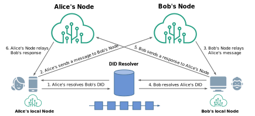

Decentralized Web Node
==================

**Specification Status:** Draft

**Latest Draft:**
  [identity.foundation/decentralized-web-node/spec](https://identity.foundation/decentralized-web-node/spec)
<!-- -->

**Previous Draft:**
  [0.0.1-predraft](https://identity.foundation/decentralized-web-node/spec/0.0.1-predraft/)

**Companion Guide**
  [v0.0.1](https://identity.foundation/decentralized-web-node/guide/v0.0.1)

**Chairs**

~ [Andor Kesselman](https://www.linkedin.com/in/andorsk/)
~ [Liran Cohen](https://www.linkedin.com/in/itsliran/)

**Editors:**
~ [Daniel Buchner](https://www.linkedin.com/in/dbuchner/) (Block)
~ [Tobias Looker](https://www.linkedin.com/in/tplooker) (Mattr)

**Contributors:**
~ [Henry Tsai](https://www.linkedin.com/in/henry-tsai-6b884014/) (Microsoft)
~ [XinAn Xu](https://www.linkedin.com/in/xinan-xu-b868a326/) (Microsoft)
~ [Moe Jangda](https://www.linkedin.com/in/moejangda/) (Block)

**Participate:**
~ [GitHub repo](https://github.com/decentralized-identity/decentralized-web-node)
~ [File a bug](https://github.com/decentralized-identity/decentralized-web-node/issues)
~ [Commit history](https://github.com/decentralized-identity/decentralized-web-node/commits/main)

------------------------------------

## Abstract

Most digital activities between people, organizations, devices, and other entities 
require the exchange of messages and data. For entities to exchange messages and 
data for credential, app, or service flows, they need an interface through which 
to store, discover, and fetch data related to the flows and experiences they are 
participating in. A Decentralized Web Node (DWN) is a data storage and message relay mechanism 
entities can use to locate public or private permissioned data related to a given 
Decentralized Identifier (DID). Decentralized Web Nodes are a mesh-like datastore construction 
that enable an entity to operate multiple nodes that sync to the same state across 
one another, enabling the owning entity to secure, manage, and transact their data 
with others without reliance on location or provider-specific infrastructure, 
interfaces, or routing mechanisms.

## Status of This Document

Decentralized Web Node is a _DRAFT_ specification under development within
the [Decentralized Identity Foundation](https://identity.foundation) (DIF). It is an active work item of the 
[Secure Data Storage Working Group at DIF](https://identity.foundation/working-groups/secure-data-storage.html).
It incorporates requirements and learnings from related work of many active industry players into a shared
specification that meets the collective needs of the community. 

The specification will be updated to incorporate feedback, from DIF members and 
the wider community, with a reference implementation being developed within DIF 
that exercises the features and requirements defined here. We encourage reviewers 
to submit [GitHub Issues](https://github.com/decentralized-identity/decentralized-web-node/issues) 
as the means by which to communicate feedback and contributions.

## Terminology

[[def:Decentralized Web Node, Decentralized Web Nodes, DWN, Node, Nodes]]
~ A decentralized personal and application data storage and message relay node, 
as defined in the DIF Decentralized Web Node specification. Users may have multiple 
Nodes that replicate their data between them.

[[def:Decentralized Identifiers, Decentralized Identifier, DID]]
~ Unique ID URI string and PKI metadata document format for describing the
cryptographic keys and other fundamental PKI values linked to a unique,
user-controlled, self-sovereign identifier in a target system (e.g., blockchain,
distributed ledger).

## Topology



## Technical Stack

Decentralized Web Nodes are comprised of the following component layers, each of which is defined 
in this specification to ensure multiple Decentralized Web Node implementations can be used together and operate 
as a single logical unit for users.

<style id="protocol-stack-styles">
  #protocol-stack-styles + table {
    display: table;
    width: 400px;
    border-radius: 4px;
    box-shadow: 0 1px 3px -1px rgb(0 0 0 / 80%);
    overflow: hidden;
  }
  #protocol-stack-styles + table tr, #protocol-stack-styles + table td {
    border: none;
  }
  #protocol-stack-styles + table tr {
    text-shadow: 0 1px 2px rgb(255 255 255 / 75%);
  }
  #protocol-stack-styles + table tr:nth-child(1) {
    background: hsl(0deg 100% 87%);
  }
  #protocol-stack-styles + table tr:nth-child(2) {
    background: hsl(0deg 100% 82%);
  }
  #protocol-stack-styles + table tr:nth-child(3) {
    background: hsl(198deg 100% 87%);
  }
  #protocol-stack-styles + table tr:nth-child(4) {
    background: hsl(198deg 100% 77%);
  }
  #protocol-stack-styles + table tr:nth-child(5) {
    background: hsl(274deg 100% 91%);
  }
  #protocol-stack-styles + table tr:nth-child(6) {
    background: hsl(274deg 100% 85%);
  }
  #protocol-stack-styles + table tr:nth-child(7) {
    background: hsl(149deg 100% 86%);
  }
  #protocol-stack-styles + table tr:nth-child(8) {
    background: hsl(149deg 100% 73%);
  }
</style>

:----: |
DID Authentication |
Access & Authorization |
Interface Definitions |
Interface-Specific Processing |
Object Format |
Object Signing / Encryption |
[IPLD Multiformats](https://multiformats.io/) |

## Service Endpoints

The following DID Document Service Endpoint entries ****MUST**** be present in the DID Document of a target DID for resolution to properly locate the URI for addressing a DID owner's Decentralized Web Nodes:

```json
{
  "id": "did:example:alice",
  "service": [{
    "id": "#dwn",
    "type": "DecentralizedWebNode",
    "enc": [
      "#dwn-enc"
    ],
    "sig": [
      "#dwn-sig"
    ],
    "serviceEndpoint": [
      "did:example:host",
      "https://dwn.example.com"
    ]
  }]
}
```

- Service Endpoints ****MUST**** contain an `id` property and it ****MUST**** be set to `#dwn`.
- Service Endpoints ****MUST**** contain a `type` property and it ****MUST**** be set to `DecentralizedWebNode`.
- Service Endpoints ****MUST**** contain a `serviceEndpoint` property and it ****MAY**** be set to:
  - either a `string` value which represents the `URL` associated with the `DWN`
  - an array of `string` values which each value represents a `URL` associated with a `DWN`
- Service Endpoints ****MUST**** contain an `enc` property and it ****MUST**** be a `string` value or an array of `string` values which represent the `keyId` associated with `encrypting` data.
- Service Endpoints ****MUST**** contain a `sig`property and it ****MUST**** be a `string` value or an array of `string` values which represent the `keyId` associated with `signing` data.


## Messages

::: warning
All references to this section are out of date and will need to be updated.
:::

All Decentralized Web Node messaging is transacted via Messages JSON objects. These objects contain message execution parameters, authorization material, authorization signatures, and signing/encryption information. For various purposes Messages rely on IPLD CIDs and DAG APIs.

```json
{  // Request Object
  "messages": [  // Message Objects
    {
      "recordId": GENERATED_CID_STRING,
      "descriptor": {
        "interface": INTERFACE_STRING,
        "method": METHOD_STRING,
        "dataCid": DATA_CID_STRING,
        "dataFormat": DATA_FORMAT_STRING,
      }
    },
    {...}
  ]
}
```

Messages objects ****MUST**** be composed as follows:

In order to enable data replication features for a [[ref: Decentralized Web Node]], all Messages MUST be committed to an IPLD DAG in a tree allocated to the DID of the owner after all subtrees are composed and committed. The top-level of Message objects MUST be committed as a [DAG CBOR](https://github.com/ipld/specs/blob/master/block-layer/codecs/dag-cbor.md) encoded object.

- Message objects ****MUST**** contain a `recordId` property, and its value ****MUST**** be the stringified [Version 1 CID](https://docs.ipfs.io/concepts/content-addressing/#identifier-formats) of the initial entry for the logical record in question, generated by running the the following [_Record ID Generation Process_](#recordid-generation){id=recordid-generation} on the initial record entry:
  1. Create a JSON object of the following composition:
      - The `recordId` CID generation object ****MUST**** contain a `descriptorCid` property, and its value ****MUST**** be the stringified [Version 1 CID](https://docs.ipfs.io/concepts/content-addressing/#identifier-formats) of the [DAG CBOR](https://github.com/ipld/specs/blob/master/block-layer/codecs/dag-cbor.md) encoded `descriptor` object.
  2. [DAG CBOR](https://github.com/ipld/specs/blob/master/block-layer/codecs/dag-cbor.md) encode the composed object.
  3. Generate a [Version 1 CID](https://docs.ipfs.io/concepts/content-addressing/#identifier-formats) from the [DAG CBOR](https://github.com/ipld/specs/blob/master/block-layer/codecs/dag-cbor.md) encoded object and output it in its stringified form.
- Message objects ****MAY**** contain a `data` property, and if present its value ****MUST**** be a `base64Url` encoded string of the Message's data.
- Message objects ****MUST**** contain a `descriptor` property, and its value ****MUST**** be an object composed as follows:
  - The object ****MUST**** contain an `interface` property, and its value ****MUST**** be a string that matches a Decentralized Web Node Interface.
  - The object ****MUST**** contain a `method` property, and its value ****MUST**** be a string that matches a Decentralized Web Node Interface method.
  - If the [Message](#messages) has data associated with it, passed directly via the `data` property of the [Message](#messages) or an external channel (e.g. IPFS fetch), the `descriptor` object ****MUST**** contain a `dataCid` property, and its value ****MUST**** be the stringified [Version 1 CID](https://docs.ipfs.io/concepts/content-addressing/#identifier-formats) of the [DAG PB](https://github.com/ipld/specs/blob/master/block-layer/codecs/dag-pb.md) encoded data.
  - If the [Message](#messages) has data associated with it, passed directly via the `data` property of the [Message](#messages) object or through a channel external to the message object, the `descriptor` object ****MUST**** contain a `dataFormat` property, and its value ****MUST**** be a string that corresponds with a registered [IANA Media Type](https://www.iana.org/assignments/media-types/media-types.xhtml) data format (the most common being plain JSON, which is indicated by setting the value of the `dataFormat` property to `application/json`), or one of the following format strings pending registration:
    - `application/vc+jwt` - the data is a JSON Web Token (JWT) [[spec:rfc7519]] formatted variant of a [W3C Verifiable Credential](https://www.w3.org/TR/vc-data-model/#json-web-token).
    - `application/vc+ldp` - the data is a JSON-LD formatted [W3C Verifiable Credential](https://www.w3.org/TR/vc-data-model).

::: note
Individual Interface methods may describe additional properties that the `descriptor` object ****MUST**** or ****MAY**** contain, which are detailed in the [Interfaces](#interfaces) section of the specification.
:::

### Message Authorization

Some messages may require authorization material for processing them in accordance with the permissions a [[ref: Decentralized Web Node]] owner has specified. If a message requires authorization it ****MUST**** include an `authorization` property with a value that is a [[spec:rfc7515]] General JSON Web Signature (JWS), constructed as follows:

```json
{  // Request Object
  "messages": [  // Message Objects
      "data": "bafybeigdyrzt5sfp7udm7hu76uh7y26nf3efuylqabf3oclgtqy55fbzdi",
      "recordId": "b65b7r8n7bewv5w6eb7r8n7t78yj7hbevsv567n8r77bv65b7e6vwvd67b6",
      "descriptor": {
        "interface": "Records",
        "method": "Write",
        "schema": "https://schema.org/SocialMediaPosting",
        "dataCid": CID(data),
        "dateCreated": 123456789,
        "dataFormat": "application/json"
      },
      "attestation": {
        "payload": "89f5hw458fhw958fq094j9jdq0943j58jfq09j49j40f5qj30jf",
        "signatures": [{
          "protected": "4d093qj5h3f9j204fq8h5398hf9j24f5q9h83402048h453q",
          "signature": "49jq984h97qh3a49j98cq5h38j09jq9853h409jjq09h5q9j4"
        }]
      },
      "authorization": {
        "payload": "bafybeigdyrzt5sfp7udm7hu76uh7y26nf3efuylqabf3oclgtqy55fbzdi",
        "signatures": [{
          "protected": "f454w56e57r68jrhe56gw45gw35w65w4f5i54c85j84wh5jj8h5",
          "signature": "5678nr67e56g45wf546786n9t78r67e45657bern797t8r6e5"
        }]
      }
    },
    {...}
  ]
}
```

- The JWS ****MUST**** include a `protected` property, and its value ****must**** be an object composed of the following values:
  - The object ****MUST**** include an `alg` property, and its value ****MUST**** be the string representing the algorithm used to verify the signature (as defined by the [[spec:rfc7515]] JSON Web Signature specification).
  - The object ****MUST**** include a `kid` property, and its value ****MUST**** be a [DID URL](https://w3c.github.io/did-core/#example-a-unique-verification-method-in-a-did-document) string identifying the key to be used in verifying the signature.
- The JWS ****MUST**** include a `payload` property, and its value ****must**** be an object composed of the following values:
  - The object ****MUST**** include a `descriptorCid` property, and its value ****MUST**** be the stringified [Version 1 CID](https://docs.ipfs.io/concepts/content-addressing/#identifier-formats) of the [DAG CBOR](https://github.com/ipld/specs/blob/master/block-layer/codecs/dag-cbor.md) encoded `descriptor` object.
  - The object ****MAY**** include a `permissionsGrantCid` property, and its value ****MUST**** be the stringified [Version 1 CID](https://docs.ipfs.io/concepts/content-addressing/#identifier-formats) of the [DAG CBOR](https://github.com/ipld/specs/blob/master/block-layer/codecs/dag-cbor.md) encoded  [Permission Grant](#grant) being invoked.
  - If attestation of an object is permitted, the `payload` ****MAY**** include an `attestationCid` property, and its value ****MUST**** be the stringified [Version 1 CID](https://docs.ipfs.io/concepts/content-addressing/#identifier-formats) of the [DAG CBOR](https://github.com/ipld/specs/blob/master/block-layer/codecs/dag-cbor.md) encoded `attestation` string.

### Raw Data

If there is no need or desire to sign or encrypt the content of a message (i.e. public repudiable data), the message `descriptor` object is the only property required in a [Message](#messages) (with any method-specific properties required). An optional `data` property may be passed at the [Message](#messages) level that contains the data associated with the message (when data is desired or required to be present for a given method invocation).

```json
{ // Message
  "data": BASE64URL_STRING,
  "recordId": "b65b7r8n7bewv5w6eb7r8n7t78yj7hbevsv567n8r77bv65b7e6vwvd67b6",
  "descriptor": {
    "interface": "Records",
    "method": "Write",
    "schema": "https://schema.org/InviteAction",
    "dataCid": CID(data),
    "dateCreated": 123456789,
    "dataFormat": "application/json"
  }
}
```

### Signed Data

If the object is to be attested by a signer (e.g the Node owner via signature with their DID key), the object ****MUST**** contain the following additional properties to produce a [[spec:rfc7515]] General JSON Web Signature (JWS):

```json
{ // Message
  "recordId": "b65b7r8n7bewv5w6eb7r8n7t78yj7hbevsv567n8r77bv65b7e6vwvd67b6",
  "descriptor": {
    "interface": "Records",
    "method": "Write",
    "schema": "https://schema.org/InviteAction",
    "dataCid": CID(data),
    "dateCreated": 123456789,
    "dataFormat": "application/json"
  },
  "attestation": {
    "payload": "89f5hw458fhw958fq094j9jdq0943j58jfq09j49j40f5qj30jf",
    "signatures": [{
      "protected": "4d093qj5h3f9j204fq8h5398hf9j24f5q9h83402048h453q",
      "signature": "49jq984h97qh3a49j98cq5h38j09jq9853h409jjq09h5q9j4"
    }]
  }
  ...
}
```

The message generating party ****MUST**** construct the signed message object as follows:

1. The [Message](#messages) object ****MUST**** contain an `attestation` property, and its value ****MUST**** be a General object representation of a [[spec:rfc7515]] JSON Web Signature composed as follows: 
    - The object ****must**** include a `payload` property, and its value ****must**** be the stringified [Version 1 CID](https://docs.ipfs.io/concepts/content-addressing/#identifier-formats) of the [DAG CBOR](https://github.com/ipld/specs/blob/master/block-layer/codecs/dag-cbor.md) encoded `descriptor` object, whose composition is defined in the [Message Descriptor](#message-descriptors) section of this specification.
    - The object ****MUST**** include a `protected` property, and its value ****must**** be an object composed of the following values:
        - The object ****MUST**** include an `alg` property, and its value ****MUST**** be the string representing the algorithm used to verify the signature (as defined by the [[spec:rfc7515]] JSON Web Signature specification).
        - The object ****MUST**** include a `kid` property, and its value ****MUST**** be a [DID URL](https://w3c.github.io/did-core/#example-a-unique-verification-method-in-a-did-document) string identifying the key to be used in verifying the signature.
    - The object ****MUST**** include a `signature` property, and its value ****must**** be a signature string produced by signing the `protected` and `payload` values, in accordance with the [[spec:rfc7515]] JSON Web Signature specification.

### Encrypted Data

If the object is to be encrypted (e.g the Node owner encrypting their data to keep it private), the `descriptor` object ****MUST**** be constructed as follows:

```json
{ // Message
  "data": { 
    "protected": ...,
    "recipients": ...,
    "ciphertext": ...,
    "iv": ...,
    "tag": ... 
  },
  "recordId": "b65b7r8n7bewv5w6eb7r8n7t78yj7hbevsv567n8r77bv65b7e6vwvd67b6",
  "descriptor": {
    "interface": "Records",
    "method": "Query",
    "schema": "https://schema.org/SocialMediaPosting"
  }
  ...
}
```

The message generating party ****MUST**** construct an encrypted message as follows:

1. The `encryption` property of the `descriptor` object ****MUST**** be set to the string label value of a [Supported Encryption Format](#supported-encryption-format).
2. Generate an encrypted payload from the data conformant with the format specified in the `encryption` property..
3. Generate a [Version 1 CID](https://docs.ipfs.io/concepts/content-addressing/#identifier-formats) from the payload produced in Step 2 and let the `dataCid` property of the `descriptor` object be the stringified representation of the CID.

### Signed & Encrypted Data

If the object is to be both attributed to a signer and encrypted encrypted, it ****MUST**** be structured as follows:

```json
{ // Message
  "data": { 
    "protected": ...,
    "recipients": ...,
    "ciphertext": ...,
    "iv": ...,
    "tag": ... 
  },
  "recordId": "b65b7r8n7bewv5w6eb7r8n7t78yj7hbevsv567n8r77bv65b7e6vwvd67b6",
  "descriptor": {
    "interface": "Records",
    "method": "Query",
    "schema": "https://schema.org/SocialMediaPosting"
  },
  "attestation": {
    "payload": "89f5hw458fhw958fq094j9jdq0943j58jfq09j49j40f5qj30jf",
    "signatures": [{
      "protected": "4d093qj5h3f9j204fq8h5398hf9j24f5q9h83402048h453q",
      "signature": "49jq984h97qh3a49j98cq5h38j09jq9853h409jjq09h5q9j4"
    }]
  },
}
```

The message generating party ****MUST**** construct the signed and encrypted message as follows:

1. Follow the instructions described in the [Encrypted Data](#encrypted-data) section to add the required properties to the `descriptor` and produce a [[spec:rfc7516]] JSON Web Encryption (JWE) object from the associated data.
2. Follow the instructions described in the [Signed Data](#signed-data) section to add an `attestation` property with a General object representation of a [[spec:rfc7515]] JSON Web Signature as its value.

### Response Objects

Responses from Interface method invocations are JSON objects that ****MUST**** be constructed as follows:

1. The object ****MAY**** have a `status` property if an error is produced from a general request-related issue, and if present its value ****MUST**** be an object composed of the following properties:
    - The status object ****MUST**** have a `code` property, and its value ****MUST**** be an integer set to the [HTTP Status Code](https://developer.mozilla.org/en-US/docs/Web/HTTP/Status) appropriate for the status of the response.
    - The status object ****MAY**** have a `detail` property, and if present its value ****MUST**** be a string that describes a terse summary of the status. It is ****recommended**** that the implementer set the message text to the standard title of the HTTP Status Code, when a title/message has already been defined for that code.
2. The object ****MAY**** have a `replies` property, and if present its value ****MUST**** be an array containing *Message Result Objects*{#message-results-objects} for all messages that were included in the initiating request object. The *Message Result Objects* ****MUST**** be put in the index order that matches the index of each result's corresponding request message. *Message Result Objects* are constructed as follows:
    1. The object ****MUST**** have a `status` property, and its value ****MUST**** be an object composed of the following properties:
        - The status object ****MUST**** have a `code` property, and its value ****MUST**** be an integer set to the [HTTP Status Code](https://developer.mozilla.org/en-US/docs/Web/HTTP/Status) appropriate for the status of the response.
        - The status object ****MAY**** have a `detail` property, and if present its value ****MUST**** be a string that describes a terse summary of the status. It is ****recommended**** that the implementer set the message text to the standard title of the HTTP Status Code, when a title/message has already been defined for that code.
    2. The object ****MAY**** have a `entries` property if the message request was successful. If present, its value ****MUST**** be the resulting message entries returned from the invocation of the corresponding message.

#### Request-Level Status Coding

If any of the scenarios described in this section are encountered during general message processing, the implementation ****must**** include a request-level `status` property, and its value must be an object as defined below.

**Target DID not found**

If the DID targeted by a request object is not found within the Decentralized Web Node, the implementation ****MUST**** produce a request-level `status` with the code `404`, and ****SHOULD**** use `Target DID not found within the Decentralized Web Node` as the status `detail` value.

*Response Example:*

::: example Target DID is not found
```json
{
  "status": {
    "code": 404,
    "detail": "Target DID not found within the Decentralized Web Node"
  }
}
```
:::

**General request-level processing errors**

If a general request-level error in processing occurs that is not covered by one of the specific status cases above and prevent the implementation from correctly evaluating the request, the implementation ****MUST**** produce a request-level `status` with the code `500`, and ****SHOULD**** use `The request cannot not be processed` as the status `detail` value.

*Response Example:*

::: example General request processing error
```json
{
  "status": {
    "code": 500,
    "detail": "The request could not be processed correctly"
  }
}
```
:::

#### Message-Level Status Coding

If any of the scenarios described in this section are encountered during the processing of an individual message, the implementation ****must**** include a message-level `status` property, and its value must be an object as defined below.

**Message succeeded for query/read-type interface that expects results**

If a message is processed correctly and a set of result `entries` is expected, the implementation ****MUST**** include a message-level `status` object with its `code` property set to `200`, and ****SHOULD**** use `The message was successfully processed` as the status `detail` value.

::: note
If no results are found, the `status` remains `200`, and the implementation ****MUST**** return an empty `entries` array.
:::

*Request Example:*

```json
{  // Request Object
  "messages": [  // Message Objects
    {
      "descriptor": {
        "interface": "Records",
        "method": "Query",
        "schema": "https://schema.org/SocialMediaPosting"
      }
    },
    ...
  ]
}
```

*Response Example:*

::: example Example response object
```json
{
  "replies": [
    {
      "status": { "code": 200, "detail": "OK" },
      "entries": [...]
    }
  ]
}
```
:::

**Improperly constructed message**

If a message is malformed or constructed with invalid properties/values, the implementation ****MUST**** include a message-level `status` object with its `code` property set to `400`, and ****SHOULD**** use `The message was malformed or improperly constructed` as the status `detail` value.

*Request Example:*

```json
{  // Request Object
  "messages": [  // Message Objects
    {
      "descriptorization": {
        "interface": "Records",
        "method": "Query",
        "schemata": "https://schema.org/SocialMediaPosting"
      }
    }
  ]
}
```

*Response Example:*

::: example Example response object
```json
{
  "replies": [
    {
      "status": { "code": 400, "detail": "The message was malformed or improperly constructed" }
    }
  ]
}
```
:::

**Message failed authorization requirements**

If a message fails to meet authorization requirements during processing, the implementation ****MUST**** include a message-level `status` object with its `code` property set to `401`, and ****SHOULD**** use `The message failed authorization requirements` as the status `detail` value.

*Request Example:*

```json
{  // Request Object
  "messages": [  // Message Objects
    { // Message
      "descriptor": {
        "interface": "Records",
        "method": "Write",
        "recordId": "b6464162-84af-4aab-aff5-f1f8438dfc1e",
        "dataCid": CID(data),
        "dateCreated": 123456789,
        "schema": "https://schema.org/SocialMediaPosting",
        "dataFormat": "application/json"
      }

      ^  `authorization` PROPERTY MISSING
    }
  ]
}
```

*Response Example:*

::: example Example response object
```json
{
  "replies": [
    {
      "status": { "code": 401, "detail": "OK" }
    }
  ]
}
```
:::

**Interface is not implemented**

If a message attempts to invoke an interface `method` that is not the implementation does not support, the implementation ****MUST**** include a message-level `status` object with its `code` property set to `501`, and ****SHOULD**** use `The interface method is not implemented` as the status `detail` value.

*Request Example:*

```json
{  // Request Object
  "messages": [  // Message Objects
    { // Message
      "descriptor": {
        "interface": "Records",
        "method": "Write",
        "recordId": "b6464162-84af-4aab-aff5-f1f8438dfc1e",
        "dataCid": CID(data),
        "schema": "https://schema.org/LikeAction",
        "dataFormat": "application/json"
      }
    }
  ]
}
```

*Response Example:*

::: example Example response object
```json
{
  "replies": [
    {
      "status": {
        "code": 501,
        "detail": "The interface method is not implemented"
      }
    }
  ]
}
```
:::

**Resource consumption limit exceeded**

If the DWeb Node instance receiving the request has determined that the rate of resource consumption has exceeded its tolerances and cannot process the request, the instance ****MUST**** respond with the following status entry:

*Response Example:*

::: example Example response object
```json
{
  "replies": [
    {
      "status": {
        "code": 429,
        "detail": "Resource consumption has exceeded tolerances"
      }
    }
  ]
}
```
:::

## Interfaces

### Records

To maximize decentralized app and service interoperability, the Records interface of Decentralized Web Nodes 
provides a mechanism to store data relative to shared schemas. By storing data in accordance with a 
given schema, which may be well-known in a given vertical or industry, apps and services can leverage 
the same datasets across one another, enabling a cohesive, cross-platform, cross-device, cross-app 
experience for users.

#### `RecordsRead`

`RecordsRead` messages are JSON objects that include general [Message Descriptor](#message-descriptors) properties and the following additional properties, which ****MUST**** be composed as follows:

- The message object ****MUST**** contain a `descriptor` property, and its value ****MUST**** be a JSON object composed as follows:
  - The object ****MUST**** contain an `interface` property, and its value ****MUST**** be the string `Records`.
  - The object ****MUST**** contain a `method` property, and its value ****MUST**** be the string `Read`.
  - The object ****MUST**** contain a `messageTimestamp` property, and its value
    ****MUST**** be of type string property, and its value ****MUST**** be an
    [[spec:rfc3339]] ISO 8601 timestamp that ****MUST**** be set and interpreted
    as the time the `RecordsRead` record itself was created by the requester.
  - The object ****MUST**** contain a `recordId` property, and its value ****MUST**** be the `recordId` of the logical record with which the entry corresponds.

A reference of the json schema can be found in the
[schemas](https://github.com/decentralized-identity/decentralized-web-node/blob/main/schemas/json-schemas/records/records-read.json)
directory of the specification.

<tab-panels selected-index="0">
<nav>
  <button type="button">Simple Records Read Example</button>
  <button type="button">Sample JSON Schema</button>
</nav>

<section>

::: example Records Read - Minimal Example

```json
{
	"descriptor": {
		"recordId": "b65b7r8n7bewv5w6eb7r8n7t78yj7hbevsv567n8r77bv65b7e6vwvd67b6",
		"messageTimestamp": "2002-10-02T10:00:00-05:00Z",
		"method": "Read",
		"interface": "Records"
	}
}
```
</section>

<section>

::: example Records Read - JSON Schema

```json
{
  "$schema": "http://json-schema.org/draft-07/schema#",
  "$id": "https://identity.foundation/dwn/json-schemas/records-read.json",
  "type": "object",
  "additionalProperties": false,
  "required": [
    "descriptor"
  ],
  "properties": {
    "authorization": {
      "$ref": "https://identity.foundation/dwn/json-schemas/general-jws.json"
    },
    "descriptor": {
      "type": "object",
      "additionalProperties": false,
      "required": [
        "interface",
        "method",
        "messageTimestamp",
        "recordId"
      ],
      "properties": {
        "interface": {
          "enum": [
            "Records"
          ],
          "type": "string"
        },
        "method": {
          "enum": [
            "Read"
          ],
          "type": "string"
        },
        "messageTimestamp": {
          "type": "string"
        },
        "recordId": {
          "type": "string"
        }
      }
    }
  }
}
```
</section>
</tab-panels>

#### `RecordsQuery`

`RecordsQuery` messages are JSON objects that include general [Message Descriptor](#message-descriptors) properties and the following additional properties, which ****must**** be composed as follows:

- The message object ****MUST**** contain a `descriptor` property, and its value ****MUST**** be a JSON object composed as follows:
  - The object ****MUST**** contain an `interface` property, and its value ****MUST**** be the string `Records`.
  - The object ****MUST**** contain a `method` property, and its value ****MUST**** be the string `Query`.
  - The object ****MUST**** contain a `messageTimestamp` property, and its value
    ****MUST**** be of type string property, and its value ****MUST**** be an
    [[spec:rfc3339]] ISO 8601 timestamp that ****MUST**** be set and interpreted
    as the time the `RecordsQuery` message was created by the requester.
  - The object ****MAY**** contain a `filter` property, and if present its value ****MUST**** be an object that ****MAY**** contain the following properties:
    - The object ****MAY**** contain a `attester` property representing the
      creator of the `Record(s)` did. If present its value ****MUST**** be a string in the form of a DID.
    - The object ****MAY**** contain a `receipient` property representing the
      recipient of the `Record(s)` DID If present its value ****MUST**** be a string in the form of a DID.
    - The object ****MAY**** contain a `schema` property, and if present its value ****Must**** be a URI string that indicates the schema of the associated data.
    - The object ****MAY**** contain a `recordId` property, and its value ****MUST**** be a [_Computed Record ID_](#computed-record-ids).
    - The object ****MAY**** contain a `parentId` property determined from the protocol definition, and if present its
      value ****MUST**** be a string that represents the computed record of
      the parent object.
    - The object ****MAY**** contain a `contextId` property, and its value ****MUST**** be the deterministic ID for a contextually linked set of objects.
    - The object ****MAY**** contain a `dateCreated` property. If present, it
      **MUST** include the `from` and `to` property described as a string range in the ISO 8601 format. 
      - The from properties value ****MUST**** be of type string property, and its value ****MUST**** be an [[spec:rfc3339]] ISO 8601 timestamp.
       - The to properties value ****MUST**** be of type string property, and its value ****MUST**** be an [[spec:rfc3339]] ISO 8601 timestamp.
    - The object ****MAY**** contain a `protocol` property, and its value ****MUST**** be a URI that denotes the Protocol an object is a part of.
      - If the object contains a `protocol` property the object ****MUST**** also contain a `protocolVersion` property, and its value ****Must**** be a [SemVer](https://semver.org/) string that denotes the version of the Protocol the object is a part of.
    - The object ****MAY**** contain a `dataFormat` property, and its value ****MUST**** be a string that indicates the format of the data in accordance with its MIME type designation. The most common format is JSON, which is indicated by setting the value of the `dataFormat` property to `application/json`.
    - The object ****MAY**** contain a `dateSort` field, and if present its value ****MUST**** be one of the following strings:
        - `createdAscending`: return results in order from the earliest `dateCreated` value to the latest.
        - `createdDescending`: return results in order from the latest `dateCreated` value to the earliest.
        - `publishedAscending`: return results in order from the earliest `datePublished` value to the latest.
        - `publishedDescending`: return results in order from the latest `datePublished` value to the earliest.
 
<tab-panels selected-index="0">
<nav>
  <button type="button">Simple Records Query Example</button>
  <button type="button">Simple Records Query Example 2</button>
  <button type="button">Simple Records Query Example 3</button>
  <button type="button">Sample JSON Schema For Records Query</button>
</nav>

<section>

::: Get a single object by its ID reference:

```json
{ // Message
  "descriptor": {
    "interface": "Records",
    "method": "Query",
    "filter": {
      "recordId": "b6464162-84af-4aab-aff5-f1f8438dfc1e"
    }
  }
}
```
</section>

<section>

::: Get an object of a given schema type:

```json
{ // Message
  "descriptor": {
    "interface": "Records",
    "method": "Query",
    "filter": {
      "schema": "https://schema.org/MusicPlaylist"
    }
  }
}
```
</section>

<section>

::: Get all objects of a given schema type:

```json
{ // Message
  "descriptor": {
    "interface": "Records",
    "method": "Query",
    "dateSort": "createdDescending",
    "filter": {
      "dataFormat": "image/gif"
    }
  }
}
```
</section>


<section>

::: example Records Query - JSON Schema

```json
{
  "$schema": "http://json-schema.org/draft-07/schema#",
  "$id": "https://identity.foundation/dwn/json-schemas/records-query.json",
  "type": "object",
  "additionalProperties": false,
  "required": [
    "descriptor"
  ],
  "properties": {
    "authorization": {
      "$ref": "https://identity.foundation/dwn/json-schemas/general-jws.json"
    },
    "descriptor": {
      "type": "object",
      "additionalProperties": false,
      "required": [
        "interface",
        "method",
        "messageTimestamp",
        "filter"
      ],
      "properties": {
        "interface": {
          "enum": [
            "Records"
          ],
          "type": "string"
        },
        "method": {
          "enum": [
            "Query"
          ],
          "type": "string"
        },
        "messageTimestamp": {
          "$ref": "https://identity.foundation/dwn/json-schemas/defs.json#/definitions/date-time"
        },
        "filter": {
          "type": "object",
          "minProperties": 1,
          "additionalProperties": false,
          "properties": {
            "protocol": {
              "type": "string"
            },
            "attester": {
              "$ref": "https://identity.foundation/dwn/json-schemas/defs.json#/definitions/did"
            },
            "recipient": {
              "$ref": "https://identity.foundation/dwn/json-schemas/defs.json#/definitions/did"
            },
            "contextId": {
              "type": "string"
            },
            "schema": {
              "type": "string"
            },
            "recordId": {
              "type": "string"
            },
            "parentId": {
              "type": "string"
            },
            "dataFormat": {
              "type": "string"
            },
            "dateCreated": {
              "type": "object",
              "minProperties": 1,
              "additionalProperties": false,
              "properties": {
                "from": {
                  "$ref": "https://identity.foundation/dwn/json-schemas/defs.json#/definitions/date-time"
                },
                "to": {
                  "$ref": "https://identity.foundation/dwn/json-schemas/defs.json#/definitions/date-time"
                }
              }
            }
          }
        },
        "dateSort": {
          "enum": [
            "createdAscending",
            "createdDescending",
            "publishedAscending",
            "publishedDescending"
          ],
          "type": "string"
        }
      }
    }
  }
}
```
</section>
</tab-panels>

#### `RecordsWrite`

`RecordsWrite` messages are JSON objects that include general [Message Descriptor](#message-descriptors) properties and the following additional properties, which ****must**** be composed as follows:

- The message object ****MUST**** contain a `recordId` property, and its value ****MUST**** be the `recordId` of the logical record the entry corresponds with. If the message is the initial entry for a new record, the value ****MUST**** be set to the resulting string from the [_Record ID Generation Process_](#recordid-generation).
- If the message object is attached to a Protocol, and its value ****MUST**** be a [_Computed Context ID_](#computed-context-ids). If the message is not attached to a Protocol, it ****MUST NOT**** contain a `contextId` property.
- The message object ****MUST**** contain a `descriptor` property, and its value ****MUST**** be a JSON object composed as follows:
  - The object ****MUST**** contain an `interface` property, and its value ****MUST**** be the string `Records`.
  - The object ****MUST**** contain a `method` property, and its value ****MUST**** be the string `Write`.
  - The object ****MUST**** include a `parentId` property if the currently active entry for the record is a `RecordsDelete` or a `CollectionWrite` that has a declared a Commit Strategy. The object ****MUST NOT**** contain a `parentId` under any other circumstance. If present, the value of the `parentId` property ****MUST**** be the stringified [Version 1 CID](https://docs.ipfs.io/concepts/content-addressing/#identifier-formats) of the [DAG CBOR](https://github.com/ipld/specs/blob/master/block-layer/codecs/dag-cbor.md) encoded `descriptor` object of the previous `RecordsWrite` or `RecordsDelete` entry the message is intending to overwrite.
  - The object ****MAY**** contain a `protocol` property, and its value ****Must**** be a URI that denotes the Protocol an object is a part of.
    - If the object contains a `protocol` property the object ****MUST**** also contain a `protocolVersion` property, and its value ****Must**** be a [SemVer](https://semver.org/) string that denotes the version of the Protocol the object is a part of.
  - The object ****MAY**** contain a `schema` property, and if present its value ****Must**** be a URI string that indicates the schema of the associated data and ****MUST**** be treated as an immutable value for the lifetime of the logical record.
  - The object ****MAY**** contain a `commitStrategy` property, and if present its value ****Must**** be a string from the table of registered [Commit Strategies](#commit-strategies).
  - The object ****MAY**** contain a `published` property, and if present its value ****Must**** be a boolean indicating the record's publication state. A value of `true` indicates the record has been published for public queries and consumption without requiring authorization. A value of `false` or the absence of the property indicates the record ****MUST NOT**** be served in response to public queries that lack proper authorization.
  - The object ****MAY**** contain an `encryption` property, and if present its value ****Must**** be a string that matches one of the [Supported Encryption Formats](#supported-encryption-format), indicating the encryption format with which the data is encrypted. The absence of this property indicates the data is not encrypted.
  - The object ****MUST**** contain a `dateCreated` property, and its value ****MUST**** be an [[spec:rfc3339]] ISO 8601 timestamp that ****MUST**** be set and interpreted as the time the `RecordsWrite` was created by the DID owner or another permitted party.
  - The object ****MAY**** contain a `datePublished` property, and its value ****MUST**** be an [[spec:rfc3339]] ISO 8601 timestamp that ****MUST**** be set and interpreted as the time the `RecordsWrite` was published by the DID owner or another permitted party.

```json
{ // Message
  "recordId": "b65b7r8n7bewv5w6eb7r8n7t78yj7hbevsv567n8r77bv65b7e6vwvd67b6",
  "descriptor": { // Message Descriptor
    "parentId": CID(PREVIOUS_DESCRIPTOR),
    "dataCid": CID(data),
    "dateCreated": 123456789,
    "published": true,
    "encryption": "jwe",
    "interface": "Records",
    "method": "Write",
    "schema": "https://schema.org/SocialMediaPosting",
    "commitStrategy": "json-merge",
    "dataFormat": DATA_FORMAT
  }
}
```
#### `RecordsSubscribe`

::: todo 
TODO
:::

#### `RecordsDelete`

`RecordsDelete` messages are JSON objects that include general [Message Descriptor](#message-descriptors) properties and the following additional properties, which ****must**** be composed as follows:

- The message object ****MUST**** contain a `descriptor` property, and its value ****MUST**** be a JSON object composed as follows:
  - The object ****MUST**** contain an `interface` property, and its value ****MUST**** be the string `Records`.
  - The object ****MUST**** contain a `method` property, and its value ****MUST**** be the string `Delete`.
  - The message object ****MUST**** contain a `recordId` property, and its value ****MUST**** be the `recordId` of the logical record the entry corresponds with.
  - The object ****MUST**** contain a `messageTimestamp` property, and its value
    ****MUST**** be of type string property, and its value ****MUST**** be an  [[spec:rfc3339]] ISO 8601 timestamp that ****MUST**** be set and interpreted
    as the time the `RecordsDelete` record itself was created by the requester.

<tab-panels selected-index="0">
<nav>
  <button type="button">Simple Records Delete Example</button>
  <button type="button">Sample JSON Schema For Records Delete</button>
</nav>

<section>

::: Sample Records Delete

```json
{ 
  "descriptor": { 
    "recordId": "b65b7r8n7bewv5w6eb7r8n7t78yj7hbevsv567n8r77bv65b7e6vwvd67b6",
    "messageTimestamp": 2002-10-02T10:00:00-05:00Z",
    "interface": "Records",
    "method": "Delete"
  }
}
```
</section>

<section>

::: example Records Delete - JSON Schema

```json
{
  "$schema": "http://json-schema.org/draft-07/schema#",
  "$id": "https://identity.foundation/dwn/json-schemas/records-delete.json",
  "type": "object",
  "additionalProperties": false,
  "required": [
    "authorization",
    "descriptor"
  ],
  "properties": {
    "authorization": {
      "$ref": "https://identity.foundation/dwn/json-schemas/general-jws.json"
    },
    "descriptor": {
      "type": "object",
      "additionalProperties": false,
      "required": [
        "interface",
        "method",
        "messageTimestamp",
        "recordId"
      ],
      "properties": {
        "interface": {
          "enum": [
            "Records"
          ],
          "type": "string"
        },
        "method": {
          "enum": [
            "Delete"
          ],
          "type": "string"
        },
        "messageTimestamp": {
          "type": "string"
        },
        "recordId": {
          "type": "string"
        }
      }
    }
  }
}
```
</section>
</tab-panels>

#### Computed Context IDs

::: todo
Detail how IDs are computed for record contexts.
:::

#### Retained Record Processing

Retained messages in the Records interface are those that may be stored against the specific record they are associated with. Within the Records interface the `RecordsWrite`, `RecordsCommit`, `RecordsDelete` messages are among the set that may be retained to determine the history and current data state of a record. A conforming implementation ****MUST**** perform the following steps to process retained messages:

##### If the message is a `RecordsWrite`:

1. Generate the message's [_Entry ID_](#record-entry-id){id=record-entry-id} by performing the [_Record ID Generation Process_](#recordid-generation).
    - ****IF**** the generated _Entry ID_ matches the `recordId` value of the message -- 
      -  ****IF**** [_Initial Entry_](#initial-record-entry){id=initial-record-entry} exists for a record, store the entry as the [_Initial Entry_](#initial-record-entry) for the record 
      -  ****IF**** no [_Initial Entry_](#initial-record-entry) exists and cease any further processing.
    - ****ELSE**** the message may be an overwriting entry for the record; continue processing.
2. If a message is not the [_Initial Entry_](#initial-record-entry), its `descriptor` ****MUST**** contain a `parentId` to determine the entry's position in the record's lineage. If a `parentId` is present proceed with processing, else discard the record and cease processing.
3. Ensure all immutable values from the [_Initial Entry_](#initial-record-entry) remained unchanged if present in the inbound message. If any have been mutated, discard the message and cease processing.
4. Retrieve the [_Latest Checkpoint Entry_](#latest-records-checkpoint){id=latest-records-checkpoint}, which will be either the [_Initial Entry_](#initial-record-entry) or the latest `RecordsDelete`, and compare the `parentId` value of the inbound message to the _Entry ID_ of the _Latest Checkpoint Entry_ derived from running the [_Record ID Generation Process_](#recordid-generation) on it. If the values match, proceed with processing, if the values do not match discard the message and cease processing.
5. If an existing `RecordsWrite` entry linked to the [_Latest Checkpoint Entry_](#latest-records-checkpoint) ****is not**** present and the `dateCreated` value of the inbound message is greater than the [_Latest Checkpoint Entry_](#latest-records-checkpoint), store the message as the _Latest Entry_ and cease processing, else discard the inbound message and cease processing.
6. If an exiting `RecordsWrite` entry linked to the [_Latest Checkpoint Entry_](#latest-records-checkpoint) ****is**** present all of the following conditions ****must**** be true:
    - The `dateCreated` value of the inbound message is greater than the existing `RecordsWrite`, or if the `dateCreated` values are the same, the [_Entry ID_](#record-entry-id) of the inbound message is greater than the existing entry when the [_Entry IDs_](#record-entry-id) of the two are compared lexicographically.
7. If all of the following conditions for Step 6 are true, store the inbound message as the _Latest Entry_ and discard the existing `RecordsWrite` entry that was attached to the [_Latest Checkpoint Entry_](#latest-records-checkpoint).

##### If the message is a `RecordsDelete`:

1. Ensure the record specified by the inbound message's `recordId` exists. If it does not, discard the message and cease processing.
2. Ensure all immutable values from the [_Initial Entry_](#initial-record-entry) remained unchanged if present in the inbound message. If any have been mutated, discard the message and cease processing.
3. Fetch the active `RecordsDelete` entry that exists for the record. If no such entry is present, proceed to the next step. If an active `RecordsDelete` entry for the record is present, the `dateCreated` value of the inbound message ****MUST**** be greater than the active `RecordsDelete` entry; if it is not, discard the message and cease processing.  
4. Store the message as the [_Latest Checkpoint Entry_](#latest-records-checkpoint), delete all messages back to the [_Initial Entry_](#initial-record-entry), including their data, and cease processing.

### Protocols

DWeb Nodes are designed to act the substrate upon which a wide variety of decentralized applications and services can be written. With an interface like [Records](#records) alone, a DWeb Node owner and those they permission can write isolated records, but that alone is not enough to support and facilitate decentralized apps. Protocols introduces a mechanism for declaratively encoding an app or service's underlying protocol rules, including segmentation of records, relationships between records, data-level requirements, and constraints on how participants interact with a protocol. With the DWeb Node Protocols mechanism, one can model the underpinning protocols for a vast array of use cases in a way that enables interop-by-default between app implementations that ride on top of them.

#### `ProtocolsConfigure`

`ProtocolsConfigure` messages are JSON objects that include general [Message Descriptor](#message-descriptors) properties and the following additional properties, which ****must**** be composed as follows:

```json
{
  "interface": "Protocols", // required
  "method": "Configure", // required
  "protocolVersion": "1.0.0", // required
  "definition": { PROTOCOL_DEFINITION_OBJ }, // optional
}
```

- The message object ****MUST**** contain a `recordId` property, and its value ****MUST**** be the `recordId` of the logical record the entry corresponds with.
- The message object ****MUST**** contain a `descriptor` property, and its value ****MUST**** be a JSON object composed as follows:
  - The object ****MUST**** contain an `interface` property, and its value ****MUST**** be the string `Protocols`.
  - The object ****MUST**** contain a `method` property, and its value ****MUST**** be the string `Configure`.
  - The object ****MUST**** contain a `definition` property, and its value ****Must**** be a [Protocol Definition](#protocol-definitions) object.

#### Protocol Definitions

Protocol Definition objects are declarative rules within `ProtocolConfigure` messages that specify the types, relationships, and interactions that are permitted under a given protocol installed in a DWeb Node. Inbound callers who wish to interact with a protocol must adhere to these rules, which DWeb Nodes enforce.

```json
{
  "interface": "Protocols",
  "method": "Configure",
  "definition": {
    "protocol": "https://decentralized-social-example.org/protocol/",
    "published": true,
    "types": {
      "post": {
        "schema": "https://decentralized-social-example.org/schemas/post",
        "dataFormat": ["application/json"],
      },
      "reply": {
        "schema": "https://decentralized-social-example.org/schemas/reply",
        "dataFormat": ["application/json"],
      },
      "image": {
        "dataFormat": ["image/jpeg", "image/png", "image/gif"],
      }
    },
    "structure": {
      "post": {
        "$actions": [{
          "who": "anyone",
          "can": "read",
        }],
        "reply": {
          "$actions":[{
            "who": "anyone",
            "can": "write",
          }],
          "image": {
            "$actions": [{
              "who": "anyone",
              "can": "read",
            },{
              "who": "author",
              "of": "reply",
              "can": "write",
            }]
          }
        },
        "image": {
          "$actions":[{
            "who": "anyone",
            "can": "read",
          }, {
            "who": "author",
            "of": "post",
            "can": "write",
          }]
        }
      }
    }
  }
}
```
- The _Protocols Definition_ object ****MUST****  contain a `protocol` property, and its value ****Must**** be a URI that denotes the Protocol the configuration pertains to.
- The _Protocols Definition_ ****MUST**** contain a `published` property, and its value ****Must**** be a boolean indicating the `ProtocolConfiguration`'s publication state. 
- The _Protocols Definition_ object ****MUST**** contain a `types` property, and its value ****MUST**** be an object composed as follows:
  - The keys of the object ****MUST**** be a string that represents the underlying type.
  - The values representing those keys within the object ****MUST**** be an object composed as follows:
    - The object ****MUST**** contain a `dataFormats` property, and its value ****MUST**** be an array of strings that indicate the format of the data in accordance with its MIME type designation. The most common format is JSON, which is indicated by setting the value of the `dataFormats` property to `['application/json]`.
    - The object ****MAY**** contain a `schema` property, and if present its value ****MUST**** be a valid URI string that identifies the protocol the definition pertains to.
- The _Protocols Definition_ object ****MUST**** contain a `structure` property, and its value ****MUST**** be a _Record Rules_ object whose keys match the labels defined in the _Protocols Definition_ object. This object is recursive, allowing subsequent record relationships to be defined within. Labeled members of the object are composed as follows:
  - The keys of the object ****MUST**** be a string that matches one of the `types`
  - The values representing those keys within the object ****MUST**** be an object composed as follows:
    - The object ****MAY**** contain an `$actions` property and its value ****MUST**** be an array of rule set objects described as follows:
      - The object ****MUST**** contain a `who` property and it ****MUST**** have one of the following values:
        - `anyone`
        - `author`
        - `recipient`
      - The object ****MUST**** contain a `can` property and it ****MUST**** have a value of either `read` or `write`
      - The object ****MAY**** contain a `of` property and it ****MUST**** have a string value that references one of the `types`


::: todo
ADD PROTOCOL DEFINITION SPEC TEXT
:::

##### Processing Instructions

When processing a `ProtocolsConfigure` message, a conforming implementation ****MUST**** perform the following steps:

1. If the message has a `lastConfiguration` property, ensure the referenced CID value links to a valid previous configuration for the specified protocol + version;
2. If the message:
  2a. Does not contain a `protocolDefinition` property, process the configuration as if the protocol + version is closed for interaction.
  2b. Does contain a `protocolDefinition` property, perform any indexing, setup, or optimization processes required to begin enforcing it within the implementation.
3. Store the configuration.

#### `ProtocolsQuery`

The `ProtocolsQuery` interface method allows an outside entity to query for any active protocols the owner has an active configuration for.

```json
{
  "interface": "Protocols",
  "method": "Query",
  "filter": {
    "protocol": "identity.foundation/protocols/credential-issuance",
    "versions": ["1.0.0", "2.0.0"]
  }
}
```


### Permissions

The Permissions interface provides a mechanism for external entities to request access 
to various data and functionality provided by a Decentralized Web Node. Permissions employ a 
capabilities-based architecture that allows for DID-based authorization and delegation 
of authorized capabilities to others, if allowed by the owner of a Decentralized Web Node.

#### `PermissionsRequest`

`PermissionsRequest` messages are JSON objects that include general [Message Descriptor](#message-descriptors) properties and the following additional properties, which ****must**** be composed as follows:

- The message object ****MUST**** contain a `descriptor` property, and its value ****MUST**** be a JSON object composed as follows:
  - The object ****MUST**** contain an `interface` property, and its value ****MUST**** be the string `Permissions`.
  - The object ****MUST**** contain a `method` property, and its value ****MUST**** be the string `Request`.
  - The object ****MUST**** contain a `grantedBy` property, and its value ****MUST**** be the DID URI string of the party that is granting the permission.
  - The object ****MUST**** contain a `grantedTo` property, and its value ****MUST**** be the DID URI string of the party that is being granted the permission.
  - The object ****MAY**** contain a `description` property, and its value ****MUST**** be a string that the requesting party uses to communicate what the permission is being used for.
  - The object ****MUST**** contain a `scope` property, and its value ****Must**** be an object of the following properties:
    - The object ****MUST**** contain an `interface` property, and its value ****MUST**** be the interface the requesting party wants to invoke.
    - The object ****MUST**** contain a `method` property, and its value ****MUST**** be the interface method the requesting party wants to invoke.
    - The object ****MAY**** contain a `schema` property, and its value ****Must**** be a URI string that indicates the schema of the associated data.
    - The object ****MAY**** contain a `protocol` property, and its value ****Must**** be a URI that denotes the Protocol an object is a part of.
    - The object ****MAY**** contain a `protocolVersion` property, and its value ****Must**** be a [SemVer](https://semver.org/) string that denotes the version of the Protocol the object is a part of.
    - The object ****MAY**** contain a `contextId` property, and its value ****Must**** be the deterministic ID for a contextually linked set of objects.
  - The object ****MAY**** contain a [`conditions` property](#permission-conditions){ id=permission-conditions }, and its value ****Must**** be an object of the following properties:
    - The object ****MAY**** contain an `attestation` property, and if present its value ****Must**** be a `string` representing the signing conditions detailed below. If the property is not present it ****MUST**** be evaluated as if it were set to the value `optional`.
      - `prohibited` - the object ****MUST NOT**** be signed.
      - `optional` - the object ****MAY**** be signed using a key linked to the DID of the owner of a Decentralized Web Node or authoring party (whichever is relevant to the application-level use case). 
      - `required` - the object ****MUST**** be signed using a key linked to the DID of the owner of a Decentralized Web Node or authoring party (whichever is relevant to the application-level use case). 
    - The object ****MAY**** contain an `encryption` property, and if present its value ****Must**** be a `string` representing the encryption conditions detailed below. If the property is not present it ****MUST**** be evaluated as if it were set to the value `optional`.
      - `optional` - the object ****MAY**** be encrypted using the key provided by the owner of a Decentralized Web Node in the [[spec:rfc7516]] JSON Web Encryption (JWE) format.
      - `required` - the object ****MUST**** be encrypted using the key provided by the owner of a Decentralized Web Node in the [[spec:rfc7516]] JSON Web Encryption (JWE) format.
    - The object ****MAY**** contain a `delegation` property, and its value ****Must**** be a boolean, wherein `true` indicates the issuing party is allowing the grantee the ability to delegate the capability. A value of `false` or omission of the property ****MUST**** be evaluated as false, and indicates the grantee ****MUST NOT**** be allowed to delegate the capability.
    - The object ****MAY**** contain a `publication` property, and its value ****Must**** be a boolean, wherein `true` indicates the issuing party is allowing the grantee the ability to publish data tied to methods that support the `public` boolean value in their descriptor field sets. Conforming implementations ****MUST**** throw an error and fail to grant a permission if this property is present and the `method` does not support publication.
    - The object ****MAY**** contain a `sharedAccess` property, and its value ****Must**** be a boolean, wherein `true` indicates the requesting 
      party wants the ability to use the permission against any object or data that aligns with the capability's definition, regardless of which 
      entity created the object or data. A value of `false` or omission of the property ****MUST**** be evaluated as false, and indicates the 
      requesting party only needs the ability to invoke the permission against objects or data it creates.
- The message object ****MUST**** contain an `authorization` property, which ****MUST**** be a JSON object as defined by the [Message Authorization](#message-authorization) 
  section of this specification, with the requirement that the `kid` and `signature` ****MUST**** match the DID of the requesting party.

```json
{
  "descriptor": {
  "interface": "Permissions",
  "method": "Request",
    "permissionRequestId": "b6464162-84af-4aab-aff5-f1f8438dfc1e",
    "grantedBy": "did:example:alice",
    "grantedTo": "did:example:bob",
    "description": "Help you create and edit your music playlists",
    "scope": {
      "interface": "Records",
      "method": "Write",
      "schema": "https://schema.org/MusicPlaylist"
    },
    "conditions": {
      "delegation": true,
      "publication": true,
      "sharedAccess": true,
      "encryption": "optional",
      "attestation": "prohibited"
    }
  },
  "authorization": {
    "payload": "89f5hw458fhw958fq094j9jdq0943j58jfq09j49j40f5qj30jf",
    "signatures": [{
      "protected": "4d093qj5h3f9j204fq8h5398hf9j24f5q9h83402048h453q",
      "signature": "49jq984h97qh3a49j98cq5h38j09jq9853h409jjq09h5q9j4"
    }]
  }
}
```

#### `PermissionsGrant`

`PermissionsGrant` messages are JSON objects containing capabilities granted to parties that curtail the scope of permitted activities an invoker can perform. They are generated either in response to a `PermissionsRequest` message or optimistically by a user agent without an initiating `PermissionsRequest`. `PermissionsGrant` messages include general [Message Descriptor](#message-descriptors) properties and the following additional properties:

- The message object ****MUST**** contain a `descriptor` property, and its value ****MUST**** be a JSON object composed as follows:
  - The object ****MUST**** contain an `interface` property, and its value ****MUST**** be the string `Permissions`.
  - The object ****MUST**** contain a `method` property, and its value ****MUST**** be the string `Grant`.
  - The object ****MUST**** contain a `permissionGrantId` property, and its value ****MUST**** be an [[spec:rfc4122]] UUID Version 4 string representing the reply object.
  - If the granted permission is in response to a `PermissionRequest`, the object ****MUST**** contain a `permissionRequestId` property, and its value ****MUST**** be the [[spec:rfc4122]] UUID Version 4 string of the `PermissionRequest` object the permission is being granted in relation to.
  - The object ****MUST**** contain a `grantedBy` property, and its value ****MUST**** be the DID URI string of the party that is granting the permission.
  - The object ****MUST**** contain a `grantedTo` property, and its value ****MUST**** be the DID URI string of the party that is being granted the permission.
  - If the `PermissionsGrant` is a delegated permission, the object ****MUST**** contain a `delegatedFrom` property, and its value ****MUST**** be an [[spec:rfc4122]] UUID Version 4 string matching the `permissionGrantId` of the `PermissionsGrant` it was delegated from.
  - The object ****MUST**** contain a `expiry` property, and its value ****MUST**** be a [Unix epoch timestamp](https://pubs.opengroup.org/onlinepubs/9699919799/basedefs/V1_chap04.html#tag_04_16) that can be used to trigger revocation activities.
  - The object ****MUST**** contain a `scope` property, and its value ****Must**** be an object of the following properties:
    - The object ****MUST**** contain an `interface` property, and its value ****MUST**** be the interface the requesting party wants to invoke.
    - The object ****MUST**** contain a `method` property, and its value ****MUST**** be the interface method the requesting party wants to invoke.
    - The object ****MAY**** contain a `schema` property, and its value ****Must**** be a URI string that indicates the schema of the associated data.
    - The object ****MAY**** contain a `protocol` property, and its value ****Must**** be a URI that denotes the Protocol an object is a part of.
    - The object ****MAY**** contain a `protocolVersion` property, and its value ****Must**** be a [SemVer](https://semver.org/) string that denotes the version of the Protocol the object is a part of.
    - The object ****MAY**** contain a `recordId` property, and its value ****Must**** be a UUID 4 string reference to an object.
    - The object ****MAY**** contain a `contextId` property, and its value ****Must**** be the deterministic ID for a contextually linked set of objects.
  - The object ****MAY**** contain a [`conditions` property](#permission-conditions){ id=permission-conditions }, and its value ****Must**** be an object of the following properties:
    - The object ****MAY**** contain an `attestation` property, and if present its value ****Must**** be a `string` representing the signing conditions detailed below. If the property is not present it ****MUST**** be evaluated as if it were set to the value `optional`.
      - `prohibited` - the object ****MUST NOT**** be signed.
      - `optional` - the object ****MAY**** be signed using a key linked to the DID of the owner of a Decentralized Web Node or authoring party (whichever is relevant to the application-level use case). 
      - `required` - the object ****MUST**** be signed using a key linked to the DID of the owner of a Decentralized Web Node or authoring party (whichever is relevant to the application-level use case). 
    - The object ****MAY**** contain an `encryption` property, and if present its value ****Must**** be a `string` representing the encryption conditions detailed below. If the property is not present it ****MUST**** be evaluated as if it were set to the value `optional`.
      - `optional` - the object ****MAY**** be encrypted using the key provided by the owner of a Decentralized Web Node in the [[spec:rfc7516]] JSON Web Encryption (JWE) format.
      - `required` - the object ****MUST**** be encrypted using the key provided by the owner of a Decentralized Web Node in the [[spec:rfc7516]] JSON Web Encryption (JWE) format.
    - The object ****MAY**** contain a `delegation` property, and its value ****Must**** be a boolean, wherein `true` indicates the issuing party is allowing the grantee the ability to delegate the capability. A value of `false` or omission of the property ****MUST**** be evaluated as false, and indicates the grantee ****MUST NOT**** be allowed to delegate the capability.
    - The object ****MAY**** contain a `publication` property, and its value ****Must**** be a boolean, wherein `true` indicates the issuing party is allowing the grantee the ability to publish data tied to methods that support the `public` boolean value in their descriptor field sets. Conforming implementations ****MUST**** throw an error and fail to grant a permission if this property is present and the `method` does not support publication.
    - The object ****MAY**** contain a `sharedAccess` property, and its value ****Must**** be a boolean, wherein `true` indicates the requesting 
      party wants the ability to use the permission against any object or data that aligns with the capability's definition, regardless of which 
      entity created the object or data. A value of `false` or omission of the property ****MUST**** be evaluated as false, and indicates the 
      requesting party only needs the ability to invoke the permission against objects or data it creates.
- The message object ****MUST**** contain an `authorization` property, which ****MUST**** be a JSON object as defined by the [Message Authorization](#message-authorization) 
  section of this specification, with the requirement that the `kid` and `signature` ****MUST**** match the DID of the requesting party.
- The message ****MUST**** contain a `data` payload, which is a JSON Web Token representation of the granted permission, as defined in the [Capability Objects](#capability-objects) section below.
- The message ****MUST**** contain an `encryptionKey` property if the data transacted using the permission grant is to be encrypted, per the directives for encryption under the `encryption` field of the permission's [conditions](#permission-conditions). If present, the value of the `encryptionKey` property ****MUST**** be a [[spec:rfc7516]] JSON Web Encryption (JWE) object that contains the encrypted key material required for an authorized party to decrypt the JWE represented by the `dataCid` value within the `descriptor` object.

```json
{
  "descriptor": {
    "interface": "Permissions",
    "method": "Grant",
    "permissionGrantId": "f45wve-5b56v5w-5657b4e-56gqf35v",
    "permissionRequestId": "b6464162-84af-4aab-aff5-f1f8438dfc1e",
    "grantedBy": "did:example:bob",
    "grantedTo": "did:example:carol",
    "expiry": 1575606941,
    "delegatedFrom": PARENT_PERMISSION_GRANT,
    "scope": {
      "method": "RecordsWrite",
      "schema": "https://schema.org/MusicPlaylist",
      "recordId": "f45wve-5b56v5w-5657b4e-56gqf35v"
    },
    "conditions": {
      "delegation": true,
      "publication": true,
      "sharedAccess": true,
      "encryption": "optional",
      "attestation": "prohibited"
    }
  },
  "authorization": {
    "payload": "89f5hw458fhw958fq094j9jdq0943j58jfq09j49j40f5qj30jf",
    "signatures": [{
      "protected": "4d093qj5h3f9j204fq8h5398hf9j24f5q9h83402048h453q",
      "signature": "49jq984h97qh3a49j98cq5h38j09jq9853h409jjq09h5q9j4"
    }]
  },
  "encryptionKey": { 
    "protected": ...,
    "recipients": ...,
    "ciphertext": ...,
    "iv": ...,
    "tag": ... 
  }
}
```

##### Granted Encryption Keys

The `encryptionKey` attribute of a `PermissionsGrant` is a [[spec:rfc7516]] JSON Web Encryption (JWE) object that is composed as follows:

1. The `kid` field of the JWE header ****MUST**** be a DID URL that identifies the public key type designated for encryption in the DID Document of the `PermissionGrant` recipient.
2. The `ciphertext` field ****MUST**** be encrypted with the `X25519` public key designated for encryption in the DID Document of the `PermissionGrant` recipient.
3. The data encrypted in the object's `ciphertext` field ****MUST**** be the JSON Web Key (JWK) object representation of a `AES-256` symmetric encryption key generated by the owner of the DWeb Node that will be used to encrypt the data transacted in relation to the associated `PermissionGrant`.


##### Grantor `PermissionsGrant` Storage

After generating a `PermissionsGrant` the user agent (e.g. wallet app with access to authoritative keys for a given DID) ****MUST**** commit the granted permission object to the Decentralized Web Node of the DID the grant was issued from. This will ensure that the permission is present when addressed in subsequent interface method invocations.

##### Grantee `PermissionsGrant` Delivery

Once a user agent (e.g. wallet app with access to authoritative keys for a given DID) generates a `PermissionsGrant` for an entity to permit access to data and functionality, it is the responsibility of the user agent that generated the `PermissionsGrant` to deliver it to the entity that is the subject. To do this, the user agent ****MUST**** generate a Request that includes the `PermissionsGrant` and send it to the Decentralized Web Node of the subject it has been granted to, in accordance with the [Resolution](#resolution) and [Request Construction](#request-construction) sections of this specification. 


#### `PermissionsRevoke`

Revocation of a permission is the act of closing off any additional or invalid invocations of that permission. The Revoke interface method enables revocation of a permission via direct reference to the permission's ID.

```json
{ // Message
  "descriptor": { // Message Descriptor
    "interface": "Permissions",
    "method": "Revoke",
    "permissionRevokeId": "sdfa4162-84af-4aab-aff5-f1f8438dfc1e",
    "permissionGrantId": "b6464162-84af-4aab-aff5-f1f8438dfc1e"
  }
}
```

#### `PermissionsQuery`

The `PermissionQuery` method exists to facilitate lookup of any retained Permissions objects that exist in a given DID's DWeb Node instance. 

```json
{ // Message
  "descriptor": { // Message Descriptor
    "interface": "Permissions",
    "method": "Query",
    "grantedTo": "did:example:bob"
  }
}
```

- The message object ****MUST**** contain a `descriptor` property, and its value ****MUST**** be a JSON object composed as follows:
  - The object ****MUST**** contain an `interface` property, and its value ****MUST**** be the string `Permissions`.
  - The object ****MUST**** contain a `method` property, and its value ****MUST**** be the string `Query`.
  - The object ****MAY**** contain any of the following properties from the descriptors of `PermissionsRequest`, `PermissionsGrant`, and `PermissionsRevoke` objects:
    - `permissionRequestId`
    - `permissionGrantId`
    - `permissionRevokeId`
    - `grantedBy`
    - `grantedTo`
    - `delegatedFrom`
    - all properties of `scope` objects

### Sync

The Sync interface and its methods allow different Decentralized Web Nodes to communicate and sync on the state of the data they contain, including replication of messages and files.

## Supported Encryption Schemes

A conforming implementation ****MUST**** be capable of encrypting and decrypting data stored in Decentralized Web Nodes using the following combinations of cryptographic schemes. Each scheme is a pair, wherein the symmetric keys are used to encrypt the data being protected, then subsequently shared with permitted recipients via encryption of the symmetric keys using the asymmetric key of each recipient.

| Asymmetric Key | Symmetric Key       |
| -------------- | ------------------- |
| `X25519`       | `AES-GCM`           |
| `X25519`       | `XSalsa20-Poly1305` |

## Supported Encryption Formats

A conforming implementation ****MUST**** be capable of encrypting and decrypting data stored in Decentralized Web Nodes using the following combinations of cryptographic schemes. Each scheme is a pair, wherein the symmetric keys are used to encrypt the data being protected, then subsequently shared with permitted recipients via encryption of the symmetric keys using the asymmetric key of each recipient.

| Label    | Format              |
| -------- | ------------------- |
| `jwe`    | `AES-GCM`           |
| `X25519` | `XSalsa20-Poly1305` |

## Normative References

[[spec]]
